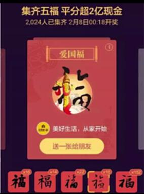
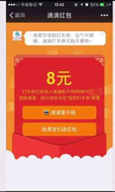
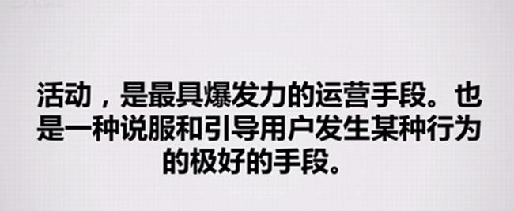
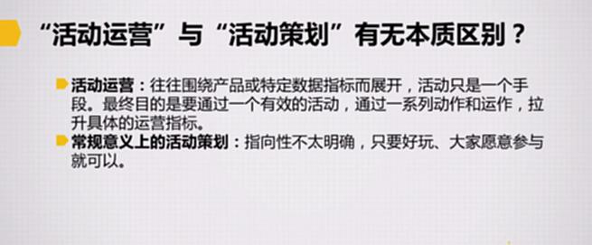
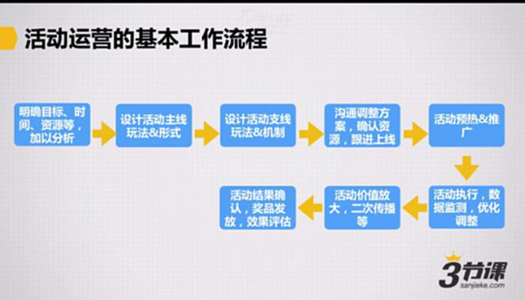
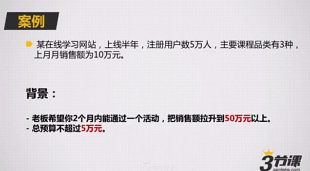
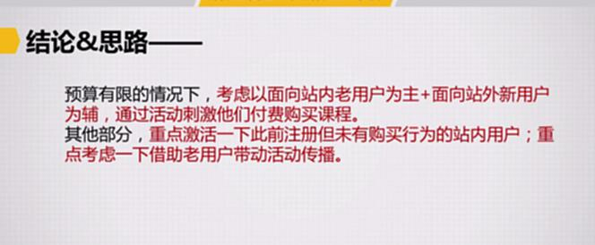

# S7.02：活动运营的基本工作流程和定位发力点

## 课程导读

很多人听说过"活动运营"，但对以下问题缺乏清晰认知：

- 活动运营的具体工作内容
- 活动运营与日常"活动策划"的区别
- 活动运营的基本工作流程

本节课程将通过案例分析，帮助你明确活动运营的核心工作方法和基本流程。

**首要任务：明确目标、资源和发力点**

活动本身是一种**手段**，而非**目的**。目标和发力点不明确的活动，即便表面热闹，实际效果往往有限。因此，活动运营的第一步是明确目标、资源和发力点。

## 典型活动案例

### 案例1：2016年支付宝集五福活动

让站内用户结成了超过10亿对用户对。

### 案例2：滴滴打车分享红包

### 案例3：天猫双十一活动

每年都会创下新高的营销活动。

---

## 活动定义

**活动是最具爆发力的运营手段**，也是说服和引导用户发生某种行为的有效方式。

**核心要点：** 活动机制设置合理、活动执行到位，可以有效撬动用户与产品建立联系。

---

## 活动运营与活动策划的区别

### 活动运营

活动运营围绕**产品或特定数据指标**（销售额、活跃用户等）展开，活动只是手段。最终目的是通过有效活动，经过一系列动作和运作，拉升具体的运营指标。

### 常规意义上的活动策划

方向性不明确，只要好玩、用户愿意参与即可。

---

## 活动运营的基本流程

### 标准化工作流程

1. **明确目标、时间、资源**
   结合产品现状，对数据进行分析，找到发力点

2. **设计活动主线玩法和形式**
   围绕发力点设计核心玩法

3. **设计活动支线玩法和机制**
   例如：征文活动中，通过奖金激励用户参与，但用户可能拖延到最后才提交。解决方案是设计支线玩法——投稿前几名可获得额外奖励。

4. **沟通调整方案，确认资源，跟进上线**
   确认分工、明确负责人等

5. **活动预热和推广**

6. **活动执行，数据监测，优化调整**

7. **活动价值放大，二次传播**
   提取活动亮点，进行二次传播

8. **活动结果确认，奖品发放，效果评估**

---

## 实战案例分析

### 案例背景

某在线学习网站，上线半年，注册用户数5万，主要课程品类有3种，上月月销售额为10万元。

### 任务要求

老板希望你2个月内通过一个活动，把销售额拉升到50万元以上，总预算不超过5万元。

### 问题分析：发力点可能在哪里？

#### 目标与资源

- 时间：2个月
- 预算：5万元
- 目标：月销售额提升到50万元以上（增长5倍）

#### 分析思路

围绕目标，思考最佳发力点：
- 流量？
- 付费转化率？
- 老用户复购？
- 新用户激活？
- ARPU值提升？
- 3种品类中的某一类重点突破？

#### 关键原则

**一定要结合站内数据分析，才能找到具体的发力点。**

#### 结论与思路

在预算有限的情况下：
- **主要策略：** 面向站内老用户为主 + 面向站外新用户为辅，通过活动刺激他们付费购买课程
- **次要策略：** 重点激活此前注册但未有购买行为的站内用户；借助老用户带动活动传播

---

## 知识要点总结

### 活动运营的基本流程

1. 明确目标、时间、资源等，结合产品现状，对数据进行分析，找到发力点
2. 设计活动主线玩法和形式
3. 设计活动支线玩法和机制
4. 沟通调整方案，确认资源，跟进上线
5. 活动预热和推广
6. 活动执行，数据监测，优化调整
7. 活动价值放大，二次传播等
8. 活动结果确认，奖品发放，效果评估

### 关键问题：发力点如何确定？

**基本思路：** 根据具体活动目标和数据分析结果进行确认。

核心原则是**以数据为依据**，结合产品现状和资源约束，找到能够有效推动目标达成的关键节点。
