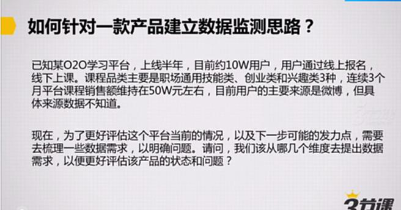
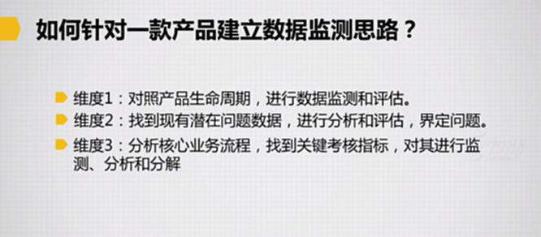
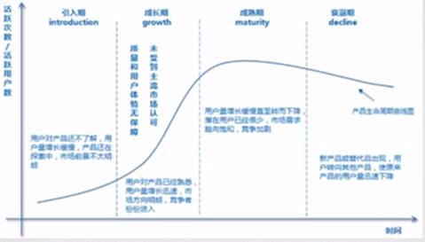
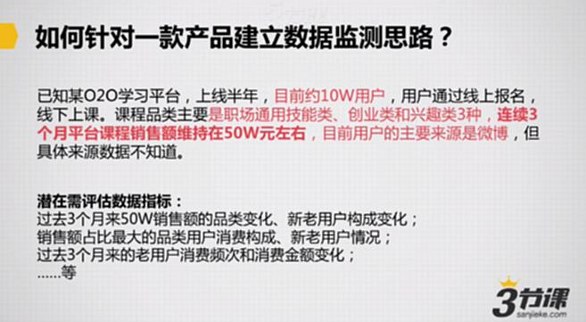
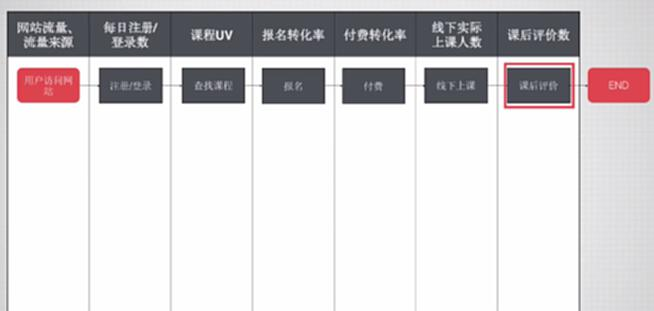

# S7.03：从数据入手明确运营目标

## 课程导读

上一节讨论了在目标相对清晰情况下的分析拆解思路。

但在实际工作中（尤其是小型创业团队），可能**没有人明确告诉你目标是什么**。这时，你需要通过数据分析，自行判断产品面临的问题和目标。

本节将通过案例说明：**当不清楚产品当前目标和问题时，如何通过监测和分析数据，找到潜在问题和发力点。**

---

## 案例背景

### 产品形态

某O2O学习平台，用户通过线上报名，线下上课。

### 业务流程思考

在设计数据监控前，首先需要清楚这类平台的业务流程是怎样的？

---

## 如何针对一款产品建立数据监控思路？

### 基本情况

- 上线时间：半年
- 用户规模：约10万
- 业务模式：用户通过线上报名，线下上课
- 课程品类：通用技能类、创业类、兴趣类3种
- 销售表现：连续3个月平台课程销售额维持在50万左右
- 流量来源：主要来源是微博，但具体来源数据未知

---

## 三大数据监控维度

### 维度1：对照产品生命周期，进行数据监测和评估

首先通过数据分析，观察产品所处的生命周期阶段。根据不同阶段，确定运营的主要目标和手段。

#### 潜在需评估的数据指标

- 半年来的用户增速
- 用户活跃变化
- 市场用户规模/现有用户比
- 用户留存率
- 市场占有率变化

---

### 维度2：找到潜在问题数据，进行分析和评估，界定问题

#### 核心问题识别

**连续3个月销售额维持在50万元左右**，这本身就是问题。针对这一问题，需要进行深入挖掘。

#### 潜在需要评估的数据指标

- 过去3个月50万元销售额的品类变化
- 新老用户构成变化
- 销售额占比最大的品类用户消费构成（新用户vs老用户比例）
- 过去3个月老用户消费频次和消费金额变化
- 用户复购率
- 客单价变化

---

### 维度3：分析核心业务流程，找到关键考核指标

#### 用户方业务流程

用户访问网站 → 注册/登录 → 查找课程 → 报名 → 付费 → 线下上课 → 课后评价 → END

#### 监测方法

根据每个步骤，监测转化率和数据表现：
- 各环节转化率
- 流失用户分析
- 关键节点完成率
- 用户路径分析

#### 老师方业务流程

同样需要建立老师端的业务流程监控体系。

---

## 知识要点：产品生命周期判断

如何判断产品处于生命周期的哪个阶段？参考标准如下：

### 探索期产品

**特征：**
- 上线时间不长
- 产品还在打磨
- 需求尚待验证
- 占据的市场份额很小
- 未被大多数人接受

**典型代表：**
- 2011-2012年间的知乎
- 2010年的新浪微博
- 绝大多数上线时间在8个月以内的产品

**运营重点：**
- 验证需求和产品价值
- 培养种子用户
- 快速迭代优化

---

### 快速增长期产品

**特征：**
- 需求已得到验证
- 初步拥有一定市场份额
- 市场上同类竞争对手大量出现
- 需要依靠快速增长迅速占领市场

**典型代表：**
- 2016年上半年的映客
- 2014年的滴滴出行
- 2013年的陌陌

**运营重点：**
- 快速获取用户
- 建立品牌认知
- 抢占市场份额

---

### 成熟稳定期产品

**特征：**
- 市场接近饱和
- 产品本身已经占据稳固的市场份额
- 增长空间较小

**典型代表：**
- 2016年的微信、百度地图
- 美柚、大姨吗等

**运营重点：**
- 提升用户活跃度
- 增加用户粘性
- 挖掘商业价值
- 防御竞品

---

### 衰退期产品

**特征：**
- 替代产品出现
- 用户开始批量流失
- 用户转移到替代产品

**典型代表：**
- 2016年的豆瓣、天涯社区、猫扑等

**运营重点：**
- 维持核心用户
- 延缓用户流失
- 探索转型方向

---

## 关键问题

看到这里，你可能认为做深入的数据分析需要很好的逻辑框架，**这个该如何解决？**

这需要系统的数据分析方法和思维框架，建议通过专项课程进行学习。

---

## 拓展知识

**数据入门分析课程**

建议学习系统的数据分析课程，掌握以下能力：

1. 建立数据分析框架
2. 掌握核心数据分析方法
3. 学会从数据中发现问题
4. 能够用数据驱动运营决策

**参考文章：**
[老黄连载|4.2 在产品的不同发展阶段，运营到底有无规律可循？](http://blog.sanjieke.cn/article/139557.html)
