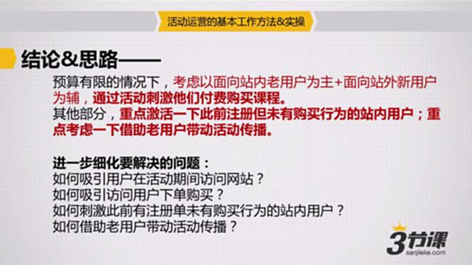

# S7.04：设计活动的主线玩法及形式

## 课程导读

上一节明确了"活动运营"的工作流程，以及如何围绕产品当前状态和所拥有的资源找到活动的核心发力点。

一旦明确了活动的核心发力点，接下来的重要工作就是：**设计活动的玩法**。

### 活动玩法设计的重要性

活动玩法设计是活动运营的关键环节：

- 玩法设计的指向性是否明确，直接决定用户看到活动的第一眼是否会产生参与兴趣
- 玩法设计的吸引力，直接影响用户的参与意愿
- 好的玩法设计能有效提升活动传播效果

### 主线玩法 vs 支线玩法

活动玩法设计分为两个部分：

1. **活动主线玩法设计** - 围绕核心发力点展开
2. **活动支线玩法设计** - 解决潜在问题和风险

本节重点讲解**活动主线玩法设计**。

---

## 核心概念：什么是活动主线玩法？

### 定义

活动主线玩法就是**围绕分析出来的发力点，解决这些发力点面临的各个问题所需要做的事情**。

换句话说，主线玩法定义了"为了达成目标，我们要让用户做什么"。

### 发力点回顾

回顾上一节的案例，我们的发力点是：

在预算有限的情况下：
- **主要策略：** 面向站内老用户为主 + 面向站外新用户为辅，通过活动刺激他们付费购买课程
- **次要策略：** 重点激活此前注册但未有购买行为的站内用户；借助老用户带动活动传播

### 问题细化

围绕上述发力点，需要解决的核心问题是：

1. 如何吸引用户在活动期间访问网站？
2. 如何吸引访问用户下单购买？
3. 如何刺激此前有注册但未有购买行为的站内用户？
4. 如何借助老用户带动活动传播？

---

## 常见的活动形式

### 核心支撑点

所有活动形式都需要满足以下基本条件：

- **有奖励** - 用户参与有实质性回报
- **有好处** - 对用户有价值
- **有价值** - 符合用户需求

### 外在表现形式

#### 1. 节日/纪念日折扣、大促

- 围绕节假日开展的促销活动
- 利用节日氛围刺激消费
- 例：双十一、618、春节活动

#### 2. 找理由送礼

- 回馈老用户
- 抽奖活动
- 达到特定条件送礼品
- 增强用户粘性和忠诚度

#### 3. 比赛、评选、竞争

- 激发用户的竞争意识
- 利用社交关系链传播
- 例：征文比赛、摄影大赛

#### 4. 趣味互动

- 游戏化设计
- 猜谜、找茬等互动形式
- 设定特定条件给予奖励
- 提升用户参与度和趣味性

---

## 活动主线玩法设计实例

### 问题1：如何吸引用户在活动期间访问网站？

**对应玩法：**
活动期间登录网站，每天均可通过抽奖随机获得额度不等的代金券或者增值服务券。

**设计原理：**
- 利用**每日抽奖**机制，吸引用户持续访问
- **随机奖励**增加刺激性和期待感
- **代金券和增值服务**提升用户获得感

### 问题2：如何吸引访问用户下单购买？如何刺激此前有注册但未有购买行为的站内用户？

**对应玩法：**
活动期间，全场8折，新用户首次下单直减100元。

**设计原理：**
- **全场8折**降低购买门槛，刺激下单
- **新用户直减100元**针对未购买用户，降低首次购买门槛
- 价格优惠是最直接的转化手段

### 问题3：如何借助老用户带动活动传播？

**对应玩法：**
两人同行，原有优惠基础上再享9折！5人团购，原有优惠基础上再享8.5折！以上优惠折扣可累加！

**设计原理：**
- 利用**社交关系链**进行传播
- **团购机制**激励用户邀请好友
- **折扣可累加**增强邀请动力
- 老用户享受更多优惠，提升参与积极性

---

## 关键问题：如何评估投入产出比（ROI）？

活动主线玩法一旦确认，就需要产出活动策划方案和说明。

### 活动策划方案的目的

活动策划方案的主要目的是：
1. 让同事、合作伙伴、上司老板理解你的思路
2. 降低沟通成本
3. 争取更多资源支持
4. 获得合作方的配合

### 优秀的活动策划方案标准

一份成功的活动方案应该做到：
- **目的清晰** - 活动要达成什么目标
- **思路明确** - 如何达成目标
- **玩法突出** - 主线玩法有吸引力
- **亮点鲜明** - 活动有什么独特之处

---

## 案例参考

### 招聘网站活动策划方案

**《三月"跳槽去哪儿"招聘活动简要策划》**

这是一份实际落地的活动策划方案，供参考学习。

密码：6gr2

该方案涵盖了：
- 活动背景与目标
- 主线玩法设计
- 执行计划
- 风险预案
- 资源需求

**建议下载学习，了解活动策划方案的具体写法。**
