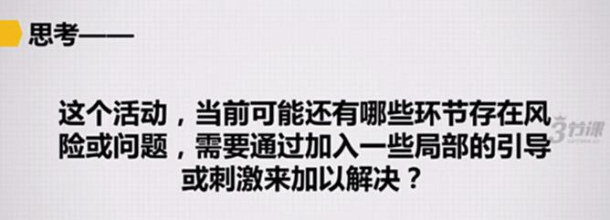
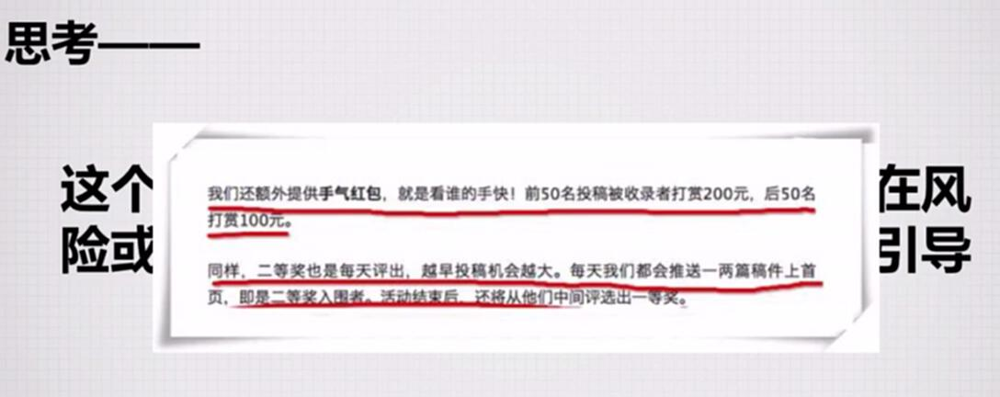
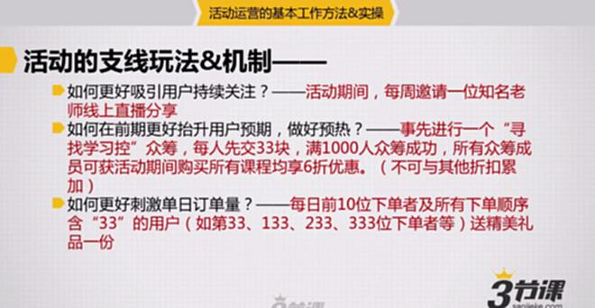

# S7.05：设计活动支线玩法及形式

## 课程导读

上一节分享了一个"跳槽去哪儿"活动的主线策划方案。这个活动会面临一个明显风险：用户会在活动开始后2-3周内对单一招聘专场形式感到疲劳。

因此，在活动支线玩法方面，**需要设计一些有话题性、与招聘求职密切相关的互动玩法，给予用户新鲜感。**

---

## 思考问题

假设你计划利用每日抽奖来提升网站浏览量，原计划持续30天。但活动发起几天后，发现每日来抽奖的用户越来越少，最后只能15天收场。老板认为活动并不成功。

**问题：** 如果再做这样的活动，如何才能让用户持续参与？

---

## 支线玩法的核心作用

### 核心问题

**这个活动当前还有哪些环节存在风险或问题，需要通过加入一些局部的引导或刺激来加以解决？**

### 支线玩法定义

**支线玩法是为了解决主线玩法之外的潜在隐患点**而设计的辅助性玩法机制。

---

## 案例：投稿活动的支线玩法

### 案例背景

### 案例说明

在征文活动中，通过奖金激励用户参与。如果没有约束，大部分用户会在最后期限才完成投稿。

**支线玩法解决方案：**
设置投稿前几名的额外奖励，刺激用户提前投稿，避免活动后期集中投稿导致质量下降。

---

## 支线玩法设计思路

### 主线玩法的隐藏问题

围绕主线玩法，需要识别潜在风险，并设计支线玩法予以解决。

#### 问题1：如何吸引用户在活动期间访问网站？

**对应主线玩法：**
活动期间登录网站，每天均可通过抽奖随机获得额度不等的代金券或者增值服务券。（有好处）

**隐藏的问题：**

1. 活动热了几天不热了怎么办？
   - **问题本质：** 如何吸引用户在活动期间持续关注？

2. 活动开始时，关注参与的人不够怎么办？
   - **问题本质：** 如何在活动前期更好地提升用户预期和参与度，做好预热？

---

#### 问题2：如何吸引访问用户下单购买？如何刺激此前有注册但未有购买行为的站内用户？

**对应主线玩法：**
活动期间，全场8折，新用户首次下单直减100元。（有好处）

**隐藏的问题：**

订单如果大量集中在某几天，或者一直有大量用户在早期观望形成羊群效应怎么办？
- **问题本质：** 如何刺激活动早期订单数以及活动单日下单数量？

---

#### 问题3：如何借助老用户带动活动传播？

**对应主线玩法：**
两人同行，原有优惠基础上再享9折！5人团购，原有优惠基础上再享8.5折！以上优惠折扣可累加！（有奖励）

---

## 支线玩法设计实例

### 针对问题1的支线玩法

#### 问题1-1：活动热了几天不热了怎么办？

**支线玩法&机制：**
活动期间，每周邀请一位知名老师线上直播分享。

**设计原理：**
- 通过**每周直播**持续制造新鲜感
- 利用**知名老师**的吸引力维持用户关注度
- 形成定期期待，提升用户回访频率

#### 问题1-2：活动开始时，关注参与的人不够怎么办？

**支线玩法&机制：**
事先进行一个"寻找学习控"众筹，每人先交33元，满1000人众筹成功，所有众筹成员可获得活动期间购买所有课程均享6折优惠（不可与其他折扣累加）。

**设计原理：**
- 通过**众筹机制**提前锁定用户
- **33元低门槛**降低参与难度
- **1000人目标**制造稀缺感和紧迫感
- **6折超值优惠**提供强激励
- 众筹过程本身也是预热传播过程

---

### 针对问题2的支线玩法

#### 问题2：订单大量集中或羊群效应怎么办？

**支线玩法&机制：**
每日前10位下单者及所有下单顺序含"33"的用户（如：第33、133、233、333位下单者等）送精美礼品一份。

**设计原理：**
- 通过**前10位奖励**刺激早期下单
- 利用**数字33**制造趣味性和话题性
- **每日更新**形成持续刺激
- 鼓励用户提前下单，避免观望

---

### 针对问题3的支线玩法

#### 问题3：如何进一步激励老用户传播？

**已有主线玩法：**
两人同行，原有优惠基础上再享9折！5人团购，原有优惠基础上再享8.5折！以上优惠折扣可累加！

**可增加的支线玩法：**
设置推荐排行榜，推荐人数最多的前10名可获得额外大奖。

**设计原理：**
- 利用**竞争心理**激励用户传播
- 通过**排行榜**放大竞争效应
- **额外大奖**提供强激励

---

## 支线玩法设计要点总结

### 设计原则

1. **问题导向** - 针对主线玩法的具体风险和问题设计
2. **渐进刺激** - 在活动不同阶段提供持续刺激
3. **心理激励** - 利用用户的竞争、好奇、从众等心理
4. **低成本高效** - 用较小的成本解决关键问题

### 常见支线玩法类型

1. **时间刺激类** - 前N名奖励、每日限量等
2. **竞争攀比类** - 排行榜、PK机制等
3. **稀缺限时类** - 限量名额、限时优惠等
4. **社交传播类** - 邀请奖励、团购优惠等
5. **持续运营类** - 定期更新、直播互动等

---

## 案例参考

### 招聘活动支线玩法设计

**《周伯通招聘"超级PK"活动介绍》**

这是一份围绕主线玩法设计的支线玩法活动方案。

密码：2wqv

该方案展示了：
- 如何识别主线玩法的潜在风险
- 如何设计针对性的支线玩法
- 支线玩法如何与主线玩法协同配合
- 实际落地的支线玩法案例

**建议下载学习，了解支线玩法的具体设计方法。**
