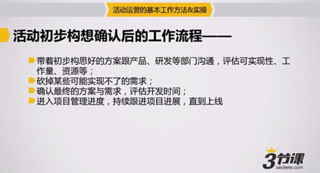
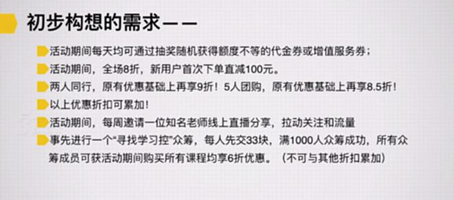
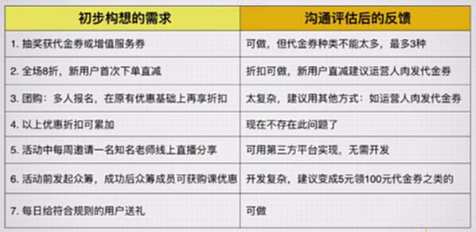
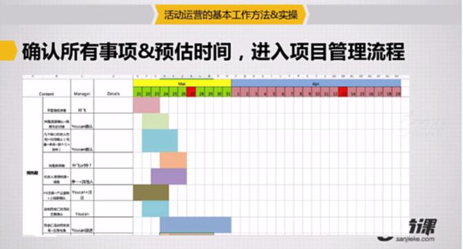

# S7.06：从活动构想到活动上线的工作流程

## 课程导读

很多运营人员认为做好活动的关键在于是否有足够好的活动Idea。其实不然。

对于互联网公司的活动运营来说，活动方案相对明确后，仅仅只是开始。从有了一个明确的Idea到最后活动可以上线，还需要经历一系列工作：

1. 与研发、产品等部门沟通，明确具体需求
2. 做好围绕整个活动上线的项目管理
3. 准备好文案等各类配套物料

本节重点讲解**活动方案和需求的确定**，以及**相关项目管理**。

---

## 沟通方案与跟进上线

### 标准化流程

1. **需求沟通与评估**
   带着初步构想好的方案跟产品、研发等部门沟通，评估可实现性、工作量、资源等

2. **需求调整与优化**
   砍掉某些可能实现不了的需求，或者调整为可实现的替代方案

3. **方案确认与排期**
   确认最终的方案与需求，评估开发时间

4. **项目管理与执行**
   进入项目管理进度，持续跟进项目进展，直到上线

---

## 实战案例：需求沟通与调整

### 初步构想需求

1. 活动期间登录网站，每天均可通过抽奖随机获得额度不等的代金券或者增值服务券
2. 活动期间，全场8折，新用户首次下单直减100元
3. 两人同行，原有优惠基础上再享9折！5人团购，原有优惠基础上再享8.5折！
4. 活动期间，每周邀请一位知名老师线上直播分享
5. 事先进行一个"寻找学习控"众筹，每人先交33元，满1000人众筹成功，所有众筹成员可获得活动期间购买所有课程均享6折优惠（不可与其他折扣累加）
6. 以上优惠折扣可累加！
7. 每日前10位下单者及所有下单顺序含"33"的用户（如：第33、133、233、333位下单者等）送精美礼品一份

---

### 沟通评估后的反馈

#### 需求调整对照表

| 初步构想的需求 | 沟通评估后的反馈 | 备注补充内容 |
| --- | --- | --- |
| 1. 抽奖获得代金券或者增值服务 | 可做，但代金券种类不能太多，最多3种 | 需要与产品进行更细致的内容沟通 |
| 2. 全场8折，新用户首次下单直减 | 折扣可做，新用户直减建议运营人工发放代金券 | 折扣可通过站内信等形式给用户 |
| 3. 团购：多人报名，在原有优惠基础上再享折扣 | 太复杂，建议用其他方式：如运营人工发代金券 | 通过站内信或微信公众号方式发送 |
| 4. 以上优惠折扣可累加 | 现在不存在这个问题了 | - |
| 5. 活动中每周邀请一名知名老师线上直播分享 | 可用第三方平台实现，无需开发 | 最多涉及设计，需要制作海报 |
| 6. 活动前发起众筹，成功后众筹成员可获得购课优惠 | 开发复杂，建议变成5元领100元优惠券之类 | 活动统一用代金券代替，开发更便捷 |
| 7. 每日给符合规则的用户送礼 | 可做 | 技术抓取33的数字，提供给运营，人工处理 |

---

### 确认所有事项与预估时间，进入项目管理流程

#### 最终方案确认

需要确认以下内容：
- 产品功能需求
- 研发开发排期
- 设计物料的交付时间
- 测试验收时间点
- 上线时间节点

#### 项目管理要点

1. **明确时间节点** - 每个环节的完成时间
2. **责任到人** - 每个任务有明确的负责人
3. **定期同步** - 定期召开项目进度会议
4. **风险预案** - 提前识别风险并准备应对方案
5. **质量把控** - 在关键节点进行验收

---

## 关键要点

### 沟通的重要性

不仅在活动期间需要随时与产品沟通，**最后的活动效果一定要以数据形式反馈给项目合作的产品、研发部门**，这是对他们的工作支持的交代，方便下次沟通合作。

### 数据反馈的意义

1. **体现价值** - 让研发和产品看到他们的工作产生了价值
2. **建立信任** - 用数据说话，增强团队信任
3. **促进合作** - 为下次合作打下良好基础
4. **总结经验** - 帮助团队了解哪些功能有效，哪些需要改进

---

## 参考案例：活动策划方案

### 母亲节活动策划方案

**《全国直营店的母亲节活动的策划方案》**

作者：早睡姐姐
来源：知乎

#### 一、活动前期的准备

**时间：** 提前一个月准备

1. **活动方案设计**
   - 确定活动目的、主题、主推品、赠品、时间、目标

2. **物料准备**
   - 文宣活动推广海报、宣传单
   - 主推品库存、赠品
   - 陈列的设计、营销销售话术的编辑
   - 确定各项的完成时间及负责人

3. **活动前期推广**
   - 公司公众微信平台
   - 各店可依附推广的平台
   - VIP平台
   - 店内的文宣海报推广

4. **相关人员培训**
   - 主推品的宣传培训
   - 赠品培训
   - 陈列培训
   - 让每个店员熟练掌握活动主题及内容

5. **店内氛围布置**
   - 文宣、主推品、赠品、音乐等就位

6. **活动前期检核**
   - 现场跟进
   - 抽查店员对活动的熟悉程度、准备情况
   - 及时调整

---

#### 二、活动期间的跟进

1. 宣布店铺销售目标及个人分解目标
2. 跟进各店销售情况，并及时播报，形成PK机制（设立全体员工QQ公开群）
3. 抽查、考核销售服务现场：主推品的销售过程、VIP服务状况、活动推进过程中存在的问题点并及时总结、调整
4. 跟进活动进行情况：每天训练的跟进、销售目标达成情况、员工活动中的状态

---

#### 三、活动结束的总结及检讨

1. 活动策划方案存在的问题点及建议
2. 主推品、赠品的合理性、储备数量、赠送建议
3. 活动进程：做得好的部分及存在的不足点
4. 总结

---

#### 四、每次活动需要整理和发放的资料

##### 每次活动要列两份清单

1. 活动明细跟进表
2. 物料清单

##### 每次活动派发三份资料

1. 《***活动前的准备工作》
2. 《***活动销售话术》
3. 《***活动微信内容》

---

## 知识要点总结

### 从构想到上线的核心步骤

1. **需求沟通** - 与产品、研发沟通可行性
2. **方案调整** - 根据反馈调整需求
3. **排期确认** - 确定各环节时间节点
4. **项目管理** - 跟进执行进度
5. **效果反馈** - 用数据反馈合作方

### 成功关键

- **充分沟通** - 确保各方理解一致
- **灵活调整** - 根据实际情况优化方案
- **严格把控** - 确保按时高质量交付
- **及时反馈** - 建立良好的合作关系
