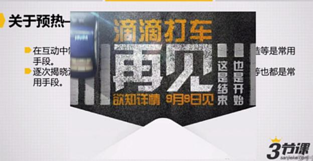
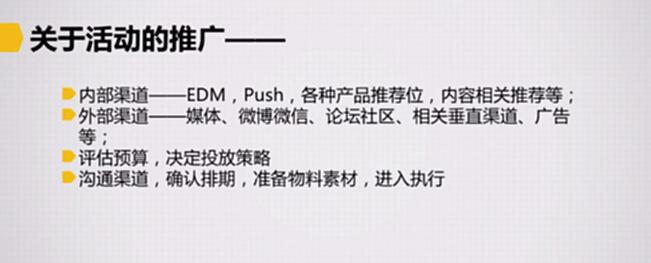
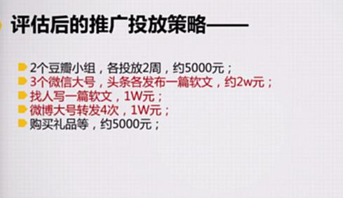

# S7.07：活动的预热和推广

## 课程导读

活动临近上线时，进入了一个新的阶段——此时活动需要密切与用户发生互动，并获得用户认可。

本节从活动的**预热**开始，讲解一个活动从开始到结束与用户发生接触和互动的全过程中的关键要点。

---

## 活动预热

### 预热的重要性

预热是活动成功的关键环节，良好的预热能够：
- 提前制造声量
- 建立用户期待
- 降低活动启动风险
- 提升活动初期效果

### 预热策略

#### 1. 制造悬念

在活动预热中，制造一些悬念往往是最佳选择。

**常用手段：**
- **竞猜活动** - 让用户猜测活动内容或嘉宾
- **悬疑营销** - 逐步释放活动信息
- **倒计时** - 建立期待感和紧迫感

**案例：**
- 活动开始时间悬念
- 嘉宾身份悬念
- 奖品悬念

---

#### 2. 逐次揭晓活动内容

逐步释放活动信息，保持关注度。

**常用手段：**
- 逐次公布活动相关参与人员
- 及时通报活动进展
- 分阶段展示活动亮点

**案例：滴滴打车更名为滴滴出行**

滴滴通过逐步释放信息的方式，成功完成了品牌更名的预热和传播。

---

## 活动推广

### 推广渠道分类

#### 1. 内部渠道

利用产品自身渠道进行推广：

- **EDM邮件营销** - 针对注册用户推送
- **Push推送** - App内推送通知
- **产品推荐位** - 首页、活动专区等
- **内容相关推荐** - 根据用户行为推荐

**优势：**
- 用户精准度高
- 转化率相对较高
- 成本较低

---

#### 2. 外部渠道

利用外部平台进行推广：

- **媒体渠道** - 行业媒体、新闻媒体
- **社交媒体** - 微博、微信、抖音等
- **论坛社区** - 知乎、豆瓣、贴吧等
- **垂直渠道** - 行业特定平台
- **广告投放** - 信息流广告、搜索广告等

**优势：**
- 覆盖面广
- 能够触达新用户
- 品牌曝光效果好

---

### 推广策略

#### 1. 预算评估

根据活动预算，决定投放策略：

- **预算充足** - 多渠道组合投放
- **预算有限** - 集中资源在高转化渠道
- **零预算** - 主要依靠内部渠道和创意传播

---

#### 2. 渠道沟通

确认推广排期，准备物料：

- **沟通渠道** - 与各渠道方确认合作细节
- **确认排期** - 明确投放时间节点
- **准备物料** - 设计海报、文案、链接等
- **进入执行** - 按计划投放推广

---

### 推广投放策略实例

**案例背景：预算5万元**

#### 渠道分配方案

1. **豆瓣小组** - 2个小组，各投放2周，约5000元
2. **微信公众号** - 3个大号，头条各发布一篇软文，约2万元
3. **软文撰写** - 找人写一篇软文，1万元
4. **礼品采购** - 购买活动礼品等，约5000元

---

#### 特别说明：投放排期设计

关于投放排期，需要细化考虑渠道间的承接效果。

**承接策略：**
- 先发一篇软文，找一个微博大号转发
- 形成初步关注和影响力
- 在微信上再发布一篇软文，对整个事件进行解读分析
- 实现二次传播，放大活动效果

**关键要点：**
- 渠道间形成联动
- 内容形成递进
- 保持话题热度
- 实现持续传播

---

## 推广效果优化

### 数据监测

推广过程中需要监测的核心数据：

1. **曝光量** - 内容被看到的次数
2. **点击量** - 用户点击链接的数量
3. **转化率** - 从点击到参与活动的比例
4. **获客成本** - 单个用户的获取成本
5. **ROI** - 投入产出比

### 优化策略

根据数据表现，及时调整推广策略：

1. **A/B测试** - 测试不同文案、创意的效果
2. **渠道优化** - 增加高转化渠道投放，减少低转化渠道
3. **内容优化** - 根据用户反馈优化推广内容
4. **时机优化** - 找到最佳投放时间段

---

## 拓展阅读案例

### 三节课产品实验室会员众筹

**背景：**
2015年8月发起的小活动，通过众筹方式为"三节课产品实验室"众筹装修经费，最终成功筹款近20万元。

**参考材料：**

1. **《产品实验室众筹项目推广方案》** - 密码：s59h
   - 完整的推广策略和执行计划
   - 渠道选择和排期安排
   - 预算分配方案

2. **《三节课众筹预热》** - 密码：uvht
   - 预热期间的文案内容
   - 预热节奏把控
   - 用户互动方式

3. **《海报》** - 密码：x5fs
   - 预热期间的7张预热海报
   - 视觉设计思路
   - 信息传达策略

**学习价值：**
- 了解零预算活动的推广思路
- 学习如何设计预热节奏
- 掌握多渠道协同的方法
- 理解内容传播的规律

---

## 知识要点总结

### 活动预热要点

1. **制造悬念** - 竞猜、悬疑、倒计时
2. **逐次揭晓** - 逐步释放活动信息
3. **通报进展** - 及时更新活动状态
4. **建立期待** - 提升用户参与意愿

### 活动推广要点

1. **内外结合** - 内部渠道与外部渠道组合
2. **评估预算** - 根据预算决定投放策略
3. **渠道协同** - 设计渠道间的承接关系
4. **数据优化** - 根据数据调整推广策略
5. **物料准备** - 提前准备好所有推广素材

### 成功关键

- **预热到位** - 提前建立用户期待
- **渠道精准** - 找到目标用户聚集的渠道
- **内容优质** - 推广内容有吸引力
- **排期合理** - 各渠道投放节奏科学
- **灵活调整** - 根据数据反馈及时优化
