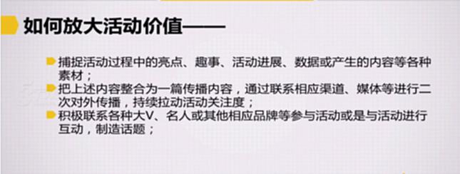
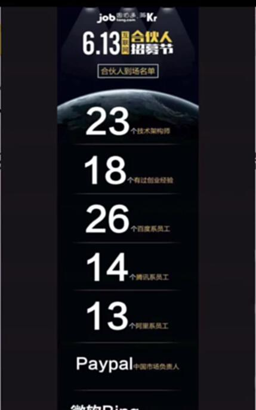
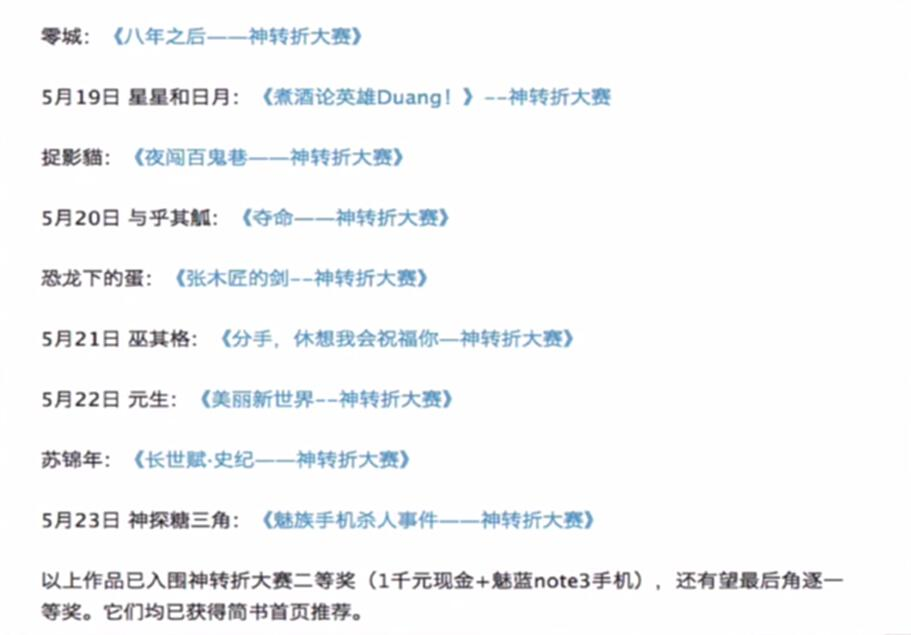
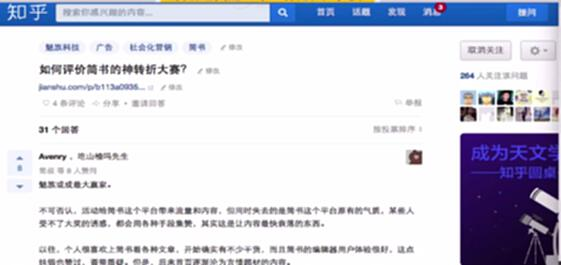
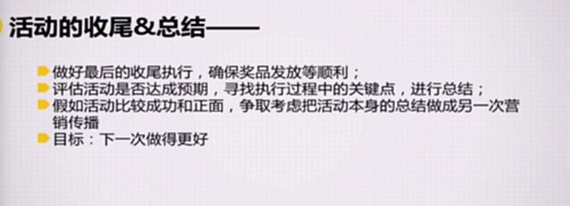

# S7.08：活动执行过程中的价值放大&收尾

## 课程导读

活动上线后，工作远未结束。如何在活动执行过程中放大活动价值，以及如何做好活动收尾和总结，是提升活动效果的关键。

---

## 如何放大活动价值

### 核心策略

活动价值放大主要通过以下三个方向：

1. 捕捉活动过程中的亮点素材
2. 整合素材进行二次传播
3. 联系大V和名人参与互动

---

### 策略1：捕捉活动过程中的亮点素材

#### 素材类型

活动过程中可以收集的素材包括：

- **活动亮点** - 活动中的精彩瞬间
- **趣味事件** - 有趣的互动或意外
- **活动进展** - 阶段性成果展示
- **数据表现** - 参与人数、互动量等
- **用户生产内容** - 用户的原创内容

#### 案例

**捕捉要点：**
- 提前规划要收集的素材类型
- 安排专人负责素材收集
- 及时记录活动中的亮点时刻
- 注意收集用户的真实反馈

---

### 策略2：整合素材进行二次传播

#### 传播方法

将收集到的素材整合为一篇传播内容，通过相应渠道、媒体等进行二次对外传播，持续拉动活动关注度。

**传播渠道：**
- 微信公众号
- 微博
- 知乎
- 媒体稿件
- 社交媒体

#### 案例：简书征文活动

简书在征文活动中，持续更新优秀征文稿件，形成二次传播。

**操作要点：**
- 筛选优质用户内容
- 进行内容包装和编辑
- 选择合适的传播时机
- 通过多渠道分发

---

### 策略3：联系大V和名人参与互动

#### 借势传播

积极联系各种大V、名人或其他相应品牌参与活动或与活动进行互动，制造话题。

**操作方式：**
- 邀请名人参与活动
- 请求名人转发或评论
- 与知名品牌联合活动
- 制造话题引发讨论

#### 案例：魏则西事件

如果认识百度贴吧产品经理，可以找到他们来分享对此事件的看法和分析。

**借势要点：**
- 找到与活动相关的热点事件
- 邀请相关领域的专业人士
- 制造有争议性或有价值的话题
- 引发用户自发讨论和传播

---

## 活动的收尾与总结

### 收尾工作

#### 1. 做好最后的收尾执行

确保所有承诺兑现：
- 奖品发放及时到位
- 用户反馈及时回复
- 未完成事项妥善处理
- 用户投诉妥善解决

**关键要点：**
- 建立奖品发放清单
- 跟踪发放进度
- 及时与用户沟通
- 处理异常情况

---

#### 2. 评估活动是否达成预期

**评估维度：**
- 目标达成率 - 是否达到预设目标
- 数据表现 - 各项核心指标数据
- 用户反馈 - 用户满意度和建议
- 执行过程 - 执行中的问题和亮点

**关键要点：**
- 收集完整数据
- 对比预期目标
- 分析成功要素
- 总结失败原因

---

#### 3. 寻找执行过程中的关键点

**关键点分析：**
- 哪些环节做得特别好
- 哪些环节出现了问题
- 哪些因素影响了效果
- 哪些做法值得复制

**分析方法：**
- 复盘整个执行过程
- 收集各参与方的反馈
- 分析数据波动原因
- 提取可复用的经验

---

#### 4. 进行总结

**总结内容：**
- 活动亮点和成果
- 存在的问题和不足
- 改进建议和方案
- 经验教训和启示

---

### 成功活动的二次营销

假如活动比较成功和正面，争取把活动本身的总结做成另一次营销传播。

**传播角度：**
1. **晒成绩** - 展示活动数据和成果
2. **讲故事** - 讲述活动背后的故事
3. **晒用户** - 展示用户的参与和反馈
4. **晒团队** - 展示团队的付出和努力

**传播形式：**
- 公众号推文
- 媒体稿件
- 行业分享
- 案例分析

---

## 总结的核心目标

### 目标：下一次做得更好

活动复盘和总结的最终目的是：
1. **提炼经验** - 形成可复制的方法论
2. **发现问题** - 找到需要改进的地方
3. **优化流程** - 完善活动执行SOP
4. **提升能力** - 提升团队运营能力

---

## 活动复盘框架

### 复盘四步法

#### 1. 回顾目标

当初的目的是什么？
- 目标是什么
- 里程碑是什么
- 预期结果是什么

#### 2. 评估结果

与实际情况相比，做到了什么程度？
- 实际发生了什么
- 与目标相比是高了还是低了
- 数据表现如何

#### 3. 分析原因

为什么会发生这种情况？
- 成功的原因是什么
- 失败的原因是什么
- 关键影响因素有哪些

#### 4. 总结规律

从中学到了什么？
- 哪些经验可以复制
- 哪些教训需要吸取
- 下次如何改进

---

## 知识要点总结

### 价值放大的三个策略

1. **捕捉素材** - 收集活动过程中的亮点、趣事、数据、用户内容
2. **二次传播** - 整合素材通过多渠道进行传播
3. **借势互动** - 联系大V、名人参与，制造话题

### 活动收尾的四个步骤

1. **收尾执行** - 确保奖品发放等收尾工作顺利
2. **效果评估** - 评估活动是否达成预期
3. **关键点分析** - 寻找执行过程中的关键点
4. **总结复盘** - 形成经验总结，指导下次活动

### 成功关键

- **全程记录** - 从活动开始就注意素材收集
- **及时传播** - 把握最佳传播时机
- **深度复盘** - 真正从活动中学习和成长
- **持续优化** - 将经验转化为可复用的方法论
