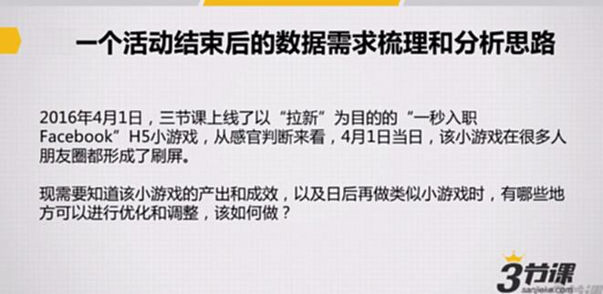
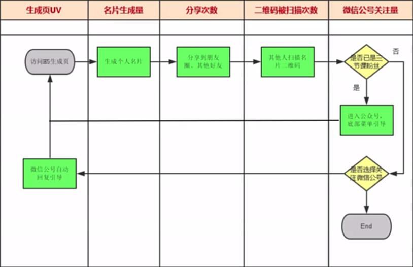
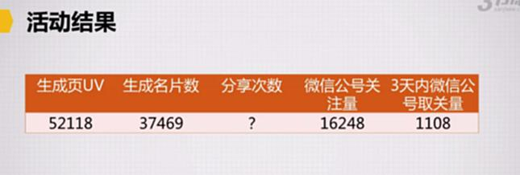

# S7.09：活动的数据监测和优化

## 课程导读

活动结束后，需要进行系统的数据梳理和分析，评估活动效果，并为后续活动优化提供依据。

本节通过实际案例，讲解如何进行活动数据的监测、分析和优化。

---

## 案例背景

### "一秒入职Facebook" H5小游戏

**时间：** 2016年4月1日
**目的：** 以"拉新"为目的
**表现：** 当日在很多人朋友圈形成刷屏

**需求：**
1. 了解该小游戏的产出和成效
2. 找出日后再做类似小游戏时可以优化和调整的地方



---

## 案例分析：1秒入职Facebook H5

### 用户操作流程

#### 游戏参与流程

1. 用户输入姓名+职位
2. 一键生成Facebook名片
3. 保存图片
4. 分享图片，与他人互动

#### 用户关注公众号流程

1. 扫描二维码
2. 进入三节课微信公众号
3. 引导用户打开H5
4. 生成自己的名片


---

### 数据梳理指标

#### 核心数据指标

1. **生成页UV** - 页面访问量
2. **生成名片数** - 实际生成名片的数量
3. **分享次数** - 用户分享图片的次数
4. **微信公众号关注量** - 新增关注用户数
5. **二维码扫描次数** - 二维码被扫描的次数
6. **3日取关率** - 活动结束后3天内取消关注的用户比例





---

### 数据分析结果

#### 核心数据表现

- **名片生成转化率：** 72%
  - 计算方式：生成名片数 / 生成页UV
  - 评价：转化率很高，说明H5设计吸引力强

- **微信关注转化率：** 31%
  - 计算方式：微信关注量 / 生成名片数
  - 评价：关注率较高，用户愿意关注公众号

- **3日取关率：** 7%
  - 计算方式：3日内取关用户数 / 新增关注用户数
  - 评价：取关率很低，用户留存质量好

#### 整体评价

这是一次比较成功的活动。

**唯一遗憾：** 转发量不是很大，病毒传播效应不足。

---

## 数据监测框架

### 活动数据梳理思路

#### 1. 建立数据漏斗

从用户接触活动到完成核心目标，建立完整的数据漏斗：

```
曝光量 → 访问量 → 参与量 → 转化量 → 留存量
```

#### 2. 定义关键指标

根据活动目的，定义核心指标：

- **拉新类活动：** 新用户数、获客成本、用户留存率
- **促活类活动：** DAU、参与率、互动频次
- **转化类活动：** 转化率、GMV、ROI
- **品牌类活动：** 曝光量、话题量、品牌认知度

#### 3. 设置数据埋点

在关键节点设置数据统计：

- 页面访问统计
- 按钮点击统计
- 转化行为统计
- 分享传播统计

---

### 数据分析维度

#### 1. 效果评估

**目标达成率：**
- 是否达到预设目标
- 各项指标完成情况
- 与历史活动对比

**投入产出比：**
- 总投入成本
- 带来的价值
- ROI计算

#### 2. 过程分析

**转化漏斗分析：**
- 各环节转化率
- 流失点识别
- 优化空间分析

**时间趋势分析：**
- 活动期间数据变化
- 高峰和低谷时段
- 影响因素分析

#### 3. 用户分析

**用户行为分析：**
- 用户参与路径
- 用户停留时长
- 用户互动方式

**用户质量分析：**
- 新老用户比例
- 用户留存率
- 用户活跃度

#### 4. 渠道分析

**渠道效果对比：**
- 各渠道带来的流量
- 各渠道转化率
- 各渠道获客成本

**渠道优化建议：**
- 哪些渠道效果好
- 哪些渠道需要优化
- 资源如何重新分配

---

## 数据优化策略

### 根据数据优化活动

#### 1. 转化率优化

**问题识别：**
- 哪个环节转化率最低
- 用户在哪里流失
- 流失原因是什么

**优化方案：**
- 优化页面设计
- 简化操作流程
- 优化文案引导
- 调整激励机制

#### 2. 传播效果优化

**提升分享率：**
- 优化分享文案
- 增加分享激励
- 设计分享福利
- 降低分享门槛

**扩大传播范围：**
- 增加推广渠道
- 优化渠道组合
- 提升内容质量
- 借助KOL影响力

#### 3. 用户质量优化

**提升留存率：**
- 优化活动内容
- 增加后续互动
- 提供持续价值
- 建立用户关系

**降低取关率：**
- 设置合理预期
- 提供优质内容
- 保持持续互动
- 避免过度打扰

---

## 知识要点总结

### 数据梳理和分析思路

1. **建立数据漏斗** - 从曝光到转化的完整路径
2. **定义关键指标** - 根据活动目的设定核心指标
3. **设置数据埋点** - 确保数据可追踪
4. **监测实时数据** - 及时发现问题和机会
5. **分析数据表现** - 找到成功要素和失败原因
6. **制定优化方案** - 基于数据优化下次活动

### 核心数据指标

1. **曝光量** - 活动被看到的次数
2. **访问量** - 实际访问活动的用户数
3. **参与量** - 参与活动的用户数
4. **转化量** - 完成核心目标的用户数
5. **留存量** - 留下来的用户数

### 成功关键

- **数据驱动** - 用数据指导决策
- **漏斗思维** - 关注每个转化环节
- **持续优化** - 不断迭代改进
- **对标分析** - 与目标和历史对比
- **总结规律** - 提炼可复用的经验

---

## 拓展阅读

### 案例详细解读

**《一天内帮助几十万人入职Facebook是一种怎样的体验？》**

#### 成果数据

1. **粉丝增长**
   - 上线后仅3小时内带来新增粉丝1万+
   - 在微信公众号涨粉手段日益枯竭的当下，这个数字非常可观

2. **H5数据**
   - 单日42万PV
   - 近29万UV
   - 超过10万人生成Facebook名片

#### 成功要素分析

**为什么H5传播量这么大？**

关键因素：
1. 切中用户心理
2. 设计简洁易用
3. 分享意愿强
4. 社交货币属性
5. 时机选择恰当（愚人节）

---

### 相关知识

**建议学习：** 《高转化的着陆页》课程

了解如何设计高转化率的落地页，提升活动效果。
