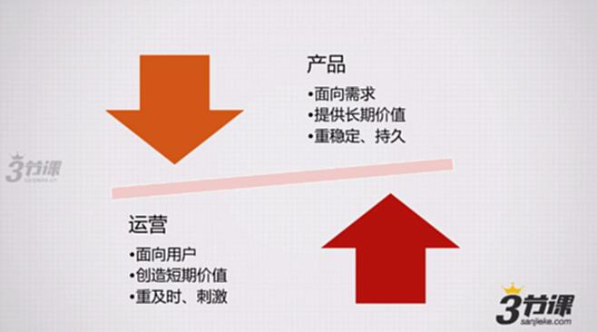
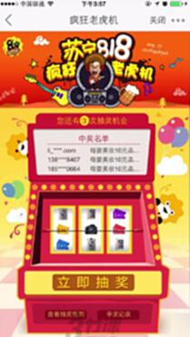
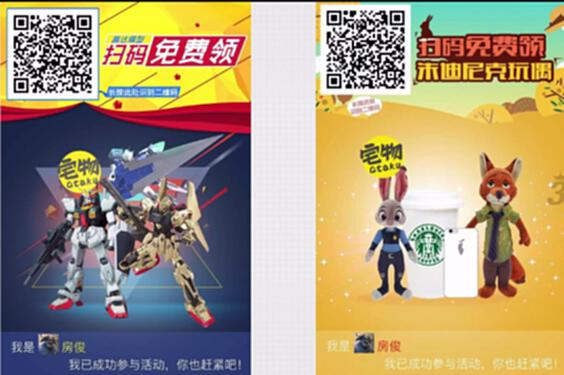

# S7.10：九大秘诀——物质激励和概率事件

## 课程导读

前面几节通过案例串联了活动运营的整个基本工作流程。本节开始,将换个视角关注另一个关键问题:

**活动能否成功的关键要素之一:活动本身能否撬动用户的参与意愿。**

大多数成功的活动,在玩法设计、活动形式和主题、策划思路方面,存在一些共性要素。这些要素能让用户参与活动与互动的意愿显著增强。

---

## 思考问题

### 礼物选择测试

做活动时,送用户礼物是最常见的形式。以下三种情况,哪种礼物送得好?

1. 双十一在淘宝做活动发政治人物传记丛书
2. 在豆瓣做活动发本年度新榜电影原声大碟
3. 在知乎做活动发巴啦啦小魔仙魔法宝典礼盒(限量珍藏版)

**答案:** 第二个最合理,符合豆瓣用户属性。其他两个没有考虑用户画像。

---

## 产品与运营的职能关系

### 产品职能

- **面向需求:** 偏向理性
- **价值提供:** 提供长期价值
- **特点:** 重稳定、持久

### 运营职能

- **面向用户:** 偏向感性
- **价值创造:** 创造短期价值
- **特点:** 重及时、刺激

**运营的核心挑战:** 如何更好创造短期价值,调动用户的参与意愿。

---

## 秘诀一:物质激励&概率事件

### 核心原理

通过物质奖励和不确定性,刺激用户参与。

**案例: 扫二维码领朱迪尼克玩偶**

**苏宁818活动**

---

### 设计要点

#### 1. 物质激励的有效性

即使采用物质激励,也需要注意:
- 奖品要与目标用户匹配
- 奖品要有吸引力
- 奖品价值感知要大于参与成本

#### 2. 与热点事件结合

与热点事件相关的奖品会更有吸引力。

**左侧: 高达  右侧: 迪士尼**

热点相关奖品的吸引力远超普通奖品。

---

### 概率事件的心理学机制

#### 不确定性的吸引力

- **确定性奖励:** 100元现金
- **不确定奖励:** 10%机会获得1000元,90%机会获得10元

在价值相等的情况下,不确定奖励往往更有吸引力。

**应用场景:**
- 抽奖活动
- 盲盒机制
- 福袋模式
- 幸运转盘

---

### 策略组合

#### 1. 物质+概率组合

"每天抽奖,有机会获得iPhone"

- 物质激励:iPhone
- 概率事件:抽奖机制
- 参与门槛:每天可参与

#### 2. 多层次奖励

- 一等奖:高价值奖品(概率低)
- 二等奖:中等价值奖品(概率中)
- 三等奖:低价值奖品(概率高)
- 参与奖:小礼品(人人有份)

#### 3. 累积机制

- 每天参与获得积分
- 积分可兑换奖品
- 积分越多,兑换奖品越好

---

## 知识要点总结

### 秘诀一:物质激励&概率事件

**核心原理:**
1. **物质激励** - 提供有价值的奖励
2. **概率事件** - 利用不确定性增强吸引力
3. **热点结合** - 提升奖品感知价值
4. **用户匹配** - 奖品符合目标用户画像

### 设计要点

1. **奖品选择**
   - 符合用户画像
   - 与热点相关
   - 感知价值高

2. **概率设计**
   - 利用不确定性
   - 设置多层级奖励
   - 保证参与率

3. **参与门槛**
   - 降低参与难度
   - 增加参与频次
   - 设计累积机制

### 应用场景

- 新用户获取
- 用户唤醒
- 活动引流
- 数据收集
- 品牌曝光

---

## 注意事项

### 避免的问题

1. **奖品与用户不匹配**
   - 问题:降低了参与意愿
   - 解决:做好用户调研

2. **概率过低**
   - 问题:用户失去信心
   - 解决:设置保底奖励

3. **奖品虚假宣传**
   - 问题:损害品牌信誉
   - 解决:如实宣传

4. **参与成本过高**
   - 问题:转化率低
   - 解决:简化流程
