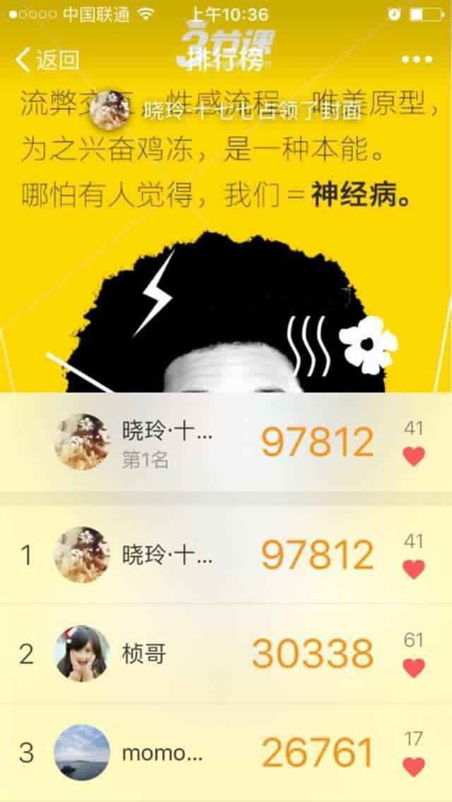
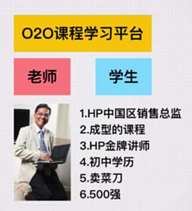
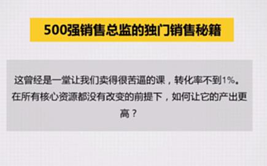
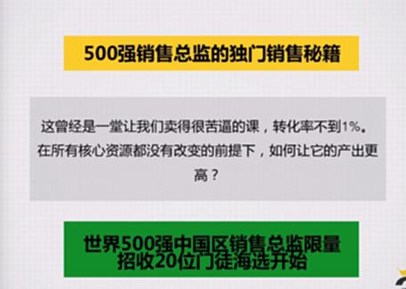
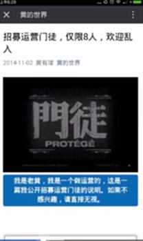
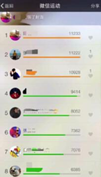
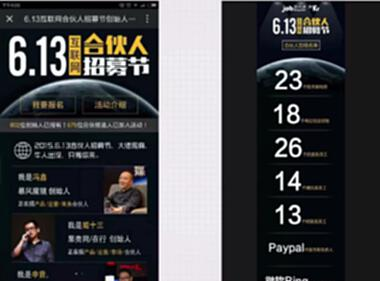
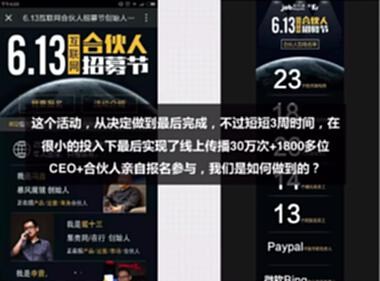
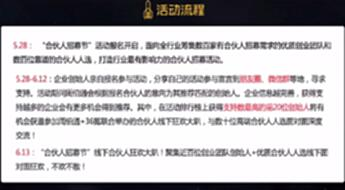

# S7.11：九大秘诀——稀缺感和竞争攀比

## 课程导读

排行榜是常见的活动形式,能够有效激发用户的竞争心理。本节讲解如何利用**稀缺感**和**竞争攀比**心理,设计更具吸引力的活动。

---

## 思考问题

### 排行榜的传播效应

三节课晓玲的微信运动排行榜,在群里引发热议:

- 有人持续刷榜
- 有人想要挑战
- 有人讨教刷榜方法

**核心问题:**
1. 为什么排行榜容易引发讨论?
2. 你参与过的竞争攀比类活动有哪些?

---

## 秘诀二:稀缺感

### 核心原理

人们倾向于认为稀有的东西更有价值。

**案例1: 线上学习平台**

线上学习平台需要同时找到老师和学生。

**案例2: 限量报名**

---

### 稀缺感的设计方法

#### 1. 限量策略

- **名额限制:** "仅限前100名"
- **时间限制:** "限时24小时"
- **资格限制:** "邀请制"
- **地域限制:** "仅限北京"

#### 2. 稀缺性表达

- "限量版"
- "绝版"
- "最后机会"
- "错过再等一年"

#### 3. 透明化稀缺

- 显示剩余名额
- 实时更新库存
- 倒计时提示
- 抢购进度展示

---

## 秘诀三:竞争&攀比

### 核心原理

通过与他人的比较,激发用户的参与动力。

**案例: 微信运动排行榜**

---

### 无预算活动案例

#### 三节课互联网招募活动

**背景:**
- 没有预算
- 参与人数少
- 需要创新玩法

**最终方案:**

---

### 竞争攀比的设计方法

#### 1. 排行榜设计

**分类排行榜:**
- 总榜
- 日榜
- 周榜
- 月榜
- 分类榜

**展示内容:**
- 排名
- 昵称/头像
- 成绩/数据
- 与前一名差距

#### 2. PK机制

- 1对1 PK
- 组队PK
- 团战
- 跨服战

#### 3. 等级体系

- 等级划分
- 段位系统
- 称号体系
- 勋章系统

---

## 实战案例

### 3.3计划稀缺营造

**活动:** 三节课3.3计划学习活动

**策略:**
- 每期以极度严苛的条件招募
- 第一期申请近300人
- 仅录取40人
- 录取率不到3%

**文案:**
"这个蓄谋已久的计划终于开启了第一次正式成员招募"

**效果:**
- 极度稀缺感
- 高度渴望
- 强烈参与意愿
- 自发传播

---

## 知识要点总结

### 秘诀二:稀缺感

**设计要点:**
1. **限量** - 名额、时间、资格限制
2. **透明** - 显示稀缺程度
3. **紧迫** - 倒计时、库存提示
4. **合理** - 稀缺要符合实际

### 秘诀三:竞争&攀比

**设计要点:**
1. **排行榜** - 多维度排名
2. **PK机制** - 对战系统
3. **等级体系** - 成长路径
4. **社交对比** - 与好友比较

### 应用场景

- 用户促活
- 提升参与度
- 增加粘性
- 社交传播
- 数据增长

---

## 注意事项

### 稀缺感设计

1. **过度营销**
   - 问题: 失去信任
   - 解决: 真实稀缺

2. **虚假稀缺**
   - 问题: 用户反感
   - 解决: 透明数据

### 竞争设计

1. **挫败感过强**
   - 问题: 用户流失
   - 解决: 分层设计

2. **数据作弊**
   - 问题: 失去公平
   - 解决: 防刷机制
