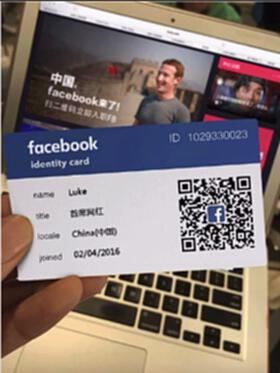
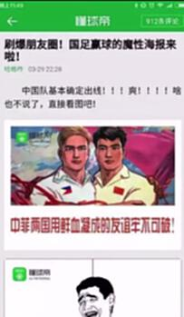
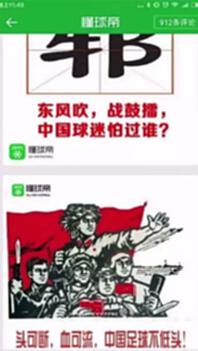
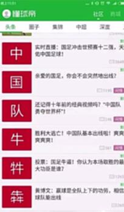
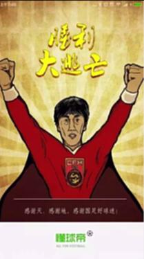
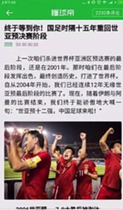
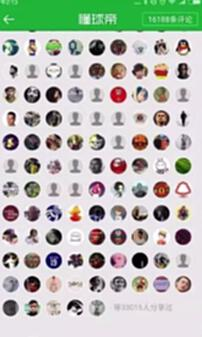
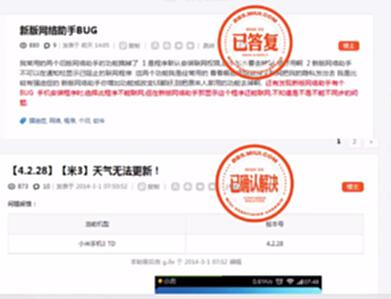

# S7.12：九大秘诀——炫耀猎奇、营造情绪、尊崇视感

## 课程导读

本节继续讲解活动设计的九大秘诀,重点介绍**炫耀猎奇**、**营造情绪**和**尊崇感&重视感**三个心理机制。

---

## 秘诀四:炫耀&猎奇

### 核心原理

满足用户的炫耀心理和猎奇心理,激发传播意愿。

**炫耀心理:** 用户希望通过活动展示自己的优秀、独特或有趣的一面
**猎奇心理:** 用户对新鲜、有趣、未知的事物充满好奇

---

### 案例1:1秒入职Facebook

**设计要点:**
- 满足炫耀心理(在Facebook工作)
- 制造猎奇效果(有趣的名片)
- 便于分享传播(朋友圈展示)

**成功要素:**
- 社交货币属性
- 话题性足够强
- 视觉冲击力
- 分享门槛低

---

### 案例2:纳斯达克动画界面

展示一个动画的纳斯达克界面,制造视觉冲击和新鲜感。

---

### 炫耀&猎奇的设计方法

#### 1. 炫耀型设计

**满足用户炫耀需求:**
- 生成可炫耀的内容(证书、勋章、成就)
- 数据可视化(跑步轨迹、阅读时长)
- 社交对比(比别人强)
- 独特性(限量、专属)

**应用场景:**
- 年度报告
- 成就展示
- 数据统计
- 等级系统

#### 2. 猎奇型设计

**制造新奇感:**
- 反常规设计
- 视觉冲击
- 未知结果
- 创意玩法

**应用场景:**
- H5小游戏
- 创意测试
- 互动问答
- 盲盒机制

---

## 秘诀五:营造强烈情绪

### 核心原理

强烈情绪能够驱动用户行为,促进分享传播。

**常见强烈情绪:**
- 激动、兴奋
- 感动、温暖
- 愤怒、不平
- 惊讶、震撼

---

### 案例:国家队世界杯出线

---

### 案例:神州租车怪蜀黍

**策略:**
- 让用户先骂你,对你好奇
- 再挽回,制造反转
- 形成强烈情绪体验

---

### 情绪营造的方法

#### 1. 正向情绪

**温暖感动:**
- 讲述感人故事
- 展示人间真情
- 激发共鸣
- 传递正能量

**激动兴奋:**
- 制造惊喜
- 设置悬念
- 突破预期
- 超额奖励

#### 2. 负向情绪

**愤怒不平:**
- 揭示问题
- 引发讨论
- 激发行动
- 推动改变

**惊讶震撼:**
- 反常规
- 大胆创意
- 视觉冲击
- 数据震撼

---

## 秘诀六:尊崇感&重视感

### 核心原理

让用户感到被重视、被尊重,提升参与意愿和忠诚度。

**心理机制:**
- 被认可的需求
- 归属感需求
- 社会地位需求
- 自尊需求

---

### 案例:专属邀请函

由用户名字的专属邀请函,设计高端大气,地点和内容都有格调。

**设计要点:**
- 个性化定制(用户姓名)
- 高端设计(有品质感)
- 独家感(不是谁都能来)
- 尊贵感(重要人物)

---

### 案例:小米论坛参与感

小米论坛通过让用户参与产品改进,给予用户尊崇感和参与感。

---

### 尊崇感&重视感的设计方法

#### 1. 专属感

- 专属邀请(定制化)
- 专属称号
- 专属权益
- 专属服务

#### 2. 重要感

- 优先体验
- 内测资格
- 决策参与
- 意见征集

#### 3. 成就感

- 认可奖励
- 展示平台
- 官方背书
- 媒体报道

---

## 知识要点总结

### 秘诀四:炫耀&猎奇

**核心要点:**
1. **炫耀心理** - 满足用户展示需求
2. **猎奇心理** - 制造新奇有趣体验
3. **社交货币** - 便于分享传播
4. **视觉冲击** - 提升吸引力

### 秘诀五:营造强烈情绪

**核心要点:**
1. **正向情绪** - 温暖、激动、兴奋
2. **负向情绪** - 愤怒、不平、惊讶
3. **情绪强度** - 越强传播力越大
4. **真实可信** - 情绪要真实自然

### 秘诀六:尊崇感&重视感

**核心要点:**
1. **专属感** - 定制化、个性化
2. **重要感** - 优先、特权
3. **成就感** - 认可、展示
4. **尊重感** - 礼遇、重视

---

## 综合应用

### 营造氛围的完整案例

**案例:国足世预赛出线**

从3月29日7点多,一直到30日上午,懂球帝集中火力打了一场漂亮的战役,做出了教科书般的经典运营案例。

**执行要点:**
1. 快速响应热点
2. 营造强烈情绪(激动、自豪)
3. 制造话题和讨论
4. 引发用户自发传播

**效果:**
- 一夜之间服务器挂了好几次
- 大量用户参与讨论
- 话题刷屏朋友圈
- 品牌知名度大幅提升
