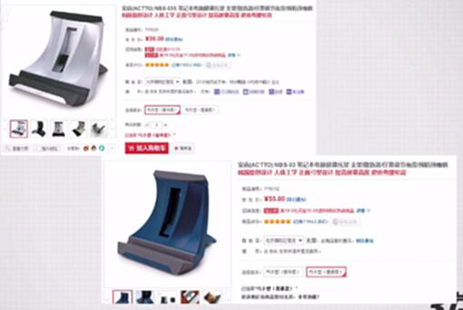
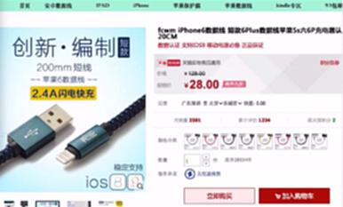
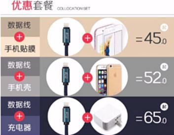
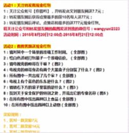
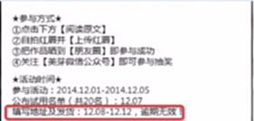
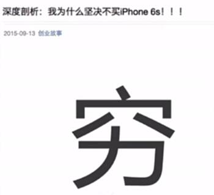
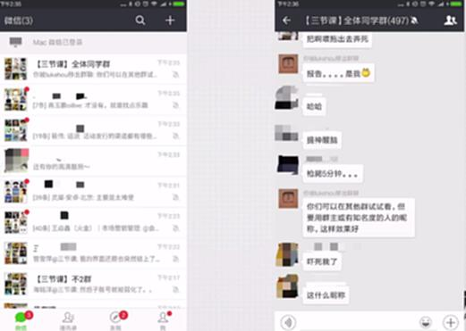

# S7.13：九大秘诀——低成本、有趣、获得超值体验

## 课程导读

本节继续讲解活动设计的九大秘诀,重点介绍**超值感**、**低成本&单线程**和**趣味性反差**三个要点。

---

## 秘诀七:超值感

### 核心原理

让用户感觉获得的远大于付出的,产生强烈的获得感。

**案例: 笔记本托架**

**设计要点:**
- 高价值感知
- 低参与成本
- 超出预期
- 性价比突出

---

### 超值感的设计方法

#### 1. 高价值奖品

- 奖品价值高
- 实用性强
- 品质保障
- 符合需求

#### 2. 低参与门槛

- 操作简单
- 时间成本低
- 无需复杂流程
- 即时反馈

#### 3. 超出预期

- 意外奖励
- 额外福利
- 惊喜设计
- 突破常规

---

## 秘诀八:低成本&单线程

### 核心原理

降低用户参与成本,简化操作流程,提升参与率。

**反面案例:**

**问题:** 文案过于复杂,增加理解成本

**优化:** 只需写明【阅读原文】,后续信息在后面说明即可。

---

### 低成本&单线程的设计方法

#### 1. 降低参与成本

**时间成本:**
- 简化操作步骤
- 减少等待时间
- 优化交互流程
- 提高响应速度

**认知成本:**
- 文案简洁明了
- 指导清晰具体
- 逻辑简单直接
- 避免复杂规则

**操作成本:**
- 一键完成
- 自动填充
- 智能推荐
- 批量处理

#### 2. 单线程设计

**一次只做一件事:**
- 避免多任务
- 专注单一目标
- 逐步引导
- 分步完成

**清晰的操作路径:**
- 第一步→第二步→第三步
- 每步明确指示
- 实时进度提示
- 完成即时反馈

---

## 秘诀九:趣味性反差

### 核心原理

通过趣味性和反差感,提升活动的吸引力和传播力。

**案例:**

---

### 趣味性反差的设计方法

#### 1. 趣味性设计

**游戏化元素:**
- 积分系统
- 成就徽章
- 等级晋升
- 任务挑战

**创意玩法:**
- 测试类
- 答题类
- 抽奖类
- 互动类

#### 2. 反差设计

**预期反差:**
- 表面严肃,实际有趣
- 看似复杂,实际简单
- 预期A,结果B

**视觉反差:**
- 色彩对比
- 大小对比
- 动静结合

**内容反差:**
- 文案反差
- 情节反转
- 意外结局

---

## 九大秘诀总结

### 完整九大秘诀

1. **物质激励&概率事件** - 通过奖励和不确定性刺激参与
2. **稀缺感** - 限量、限时制造紧迫感
3. **竞争&攀比** - 排行榜、PK机制激发动力
4. **炫耀&猎奇** - 满足展示和好奇心理
5. **营造强烈情绪** - 通过情绪驱动行为
6. **尊崇感&重视感** - 给予尊重和重视
7. **超值感** - 让用户感觉物超所值
8. **低成本&单线程** - 降低参与门槛
9. **趣味性反差** - 提升趣味和吸引力

---

### 组合应用

**单一秘诀 vs 组合使用:**

- 单一秘诀可以产生效果
- 多秘诀组合效果倍增
- 根据活动目的灵活组合
- 不同场景侧重不同秘诀

**组合示例:**

- 物质激励 + 稀缺感 + 低价成本
- 炫耀猎奇 + 趣味性 + 情绪营造
- 竞争攀比 + 尊崇感 + 超值感

---

## 知识要点总结

### 秘诀七:超值感

**核心要点:**
1. 高价值感知
2. 低参与成本
3. 超出预期
4. 性价比突出

### 秘诀八:低成本&单线程

**核心要点:**
1. 降低时间成本
2. 降低认知成本
3. 降低操作成本
4. 单线程设计

### 秘诀九:趣味性反差

**核心要点:**
1. 游戏化元素
2. 创意玩法
3. 预期反差
4. 视觉反差

---

## 应用建议

### 如何选择合适的秘诀

**根据活动目的:**
- 拉新:炫耀猎奇 + 物质激励
- 促活:竞争攀比 + 趣味性
- 转化:超值感 + 稀缺感
- 传播:情绪营造 + 炫耀猎奇

**根据用户特点:**
- 年轻用户:趣味性 + 反差感
- 专业用户:尊崇感 + 超值感
- 价格敏感:物质激励 + 稀缺感

**根据资源预算:**
- 零预算:竞争攀比 + 趣味性
- 低预算:物质激励 + 稀缺感
- 高预算:全方位组合
