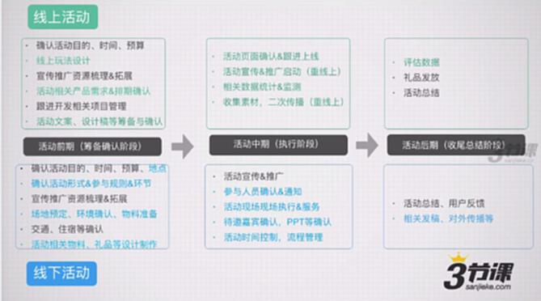

# S7.14：线上活动与线下活动的推进流程

## 课程导读

线上活动和线下活动在执行流程上存在显著差异。本节对比讲解两种活动类型的完整推进流程。

---

## 线上活动推进流程

### 活动前期(筹备确认准备)

1. **确认活动目的、时间、预算**
2. **线上玩法设计**
3. **宣传推广资源梳理&拓展**
4. **活动相关产品需求&排期确认**
5. **跟进开发相关项目管理**
6. **活动文案、设计稿等筹备确认**

---

### 活动中期(执行阶段)

1. **活动页面确认&跟进上线**
2. **活动宣传&推广启动**(重线上)
3. **相关数据统计&监测**
4. **收集素材,二次传播**(重线上)

---

### 活动后期(收尾总结阶段)

1. **评估数据**
2. **礼品发放**
3. **活动总结**

---

## 线下活动推进流程

### 活动前期(筹备确认准备)

1. **确认活动目的、时间、预算、地点**
2. **确认活动形式&参与规则&环节**
3. **宣传推广资源梳理&拓展**
4. **场地预定、环境确认、物料准备**
5. **交通、住宿等确认**
6. **活动相关物料、礼品等设计制作**

---

### 活动中期(执行阶段)

1. **活动宣传&推广**
2. **参与人员确认&通知**
3. **活动现场执行&服务**
4. **特邀嘉宾确认,PPT等确认**
5. **活动时间控制,流程管理**

---

### 活动后期(收尾总结阶段)

1. **活动总结、用户反馈**
2. **相关发稿,对外传播等**

---

## 线上与线下活动差异

**核心差异:**
- 线上活动侧重技术实现和数据监测
- 线下活动侧重场地、人员、现场管理

---

## 知识要点总结

### 线上活动特点

- **技术驱动** - 需要产品研发支持
- **数据可追踪** - 每个环节都可量化
- **可快速迭代** - 实时优化调整
- **覆盖面广** - 不受地域限制

### 线下活动特点

- **体验感强** - 面对面互动
- **执行复杂** - 涉及人员、场地、物料
- **现场管理** - 需要严格流程控制
- **地域限制** - 受场地容量限制

---

## 拓展阅读

本文讲解了针对电商的一些线上和线下推广渠道和方法。

**参考:** 知乎问答《线上与线下的活动有什么推广渠道吗?》

**作者:** 365wecall

**内容要点:**
- 电商线上推广渠道
- 电商线下推广方法  
- 渠道选择策略
- 效果评估方法
