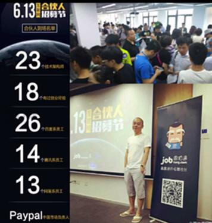
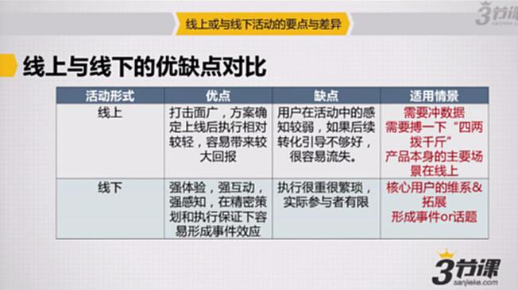

# S7.15：线上活动与线下活动的优缺点对比

## 课程导读

本节通过两个真实活动案例,对比线上活动和线下活动的差异、优缺点及适用场景,帮助你选择合适的活动形式。

---

## 案例对比

### 相同目标

两个活动目的相同:增加关注

---

### 线上活动案例:周伯通"跳槽去哪儿"

**活动成果:**
- 人力:5人,累计约700工时投入
- 方案设计&开发:3周
- 执行周期:4周
- 预算:约10万元
- 产出:超过50万人关注,网站月流量增长数百万,注册用户、发布职位等实现翻倍

---

### 线下活动案例:合伙人招聘节

**活动成果:**
- 人力:7人,累计1200工时投入
- 执行周期:4周
- 预算:3万元以内
- 产出:3000人报名,150人到场参加活动,线上传播超过40万次

---

## 线上活动优缺点对比

---

### 线上活动的优点

1. **打击面广**
   - 不受地域限制
   - 可覆盖大量用户
   - 传播速度快

2. **方案确定上线后执行相对较轻**
   - 无需场地管理
   - 人员配置少
   - 执行成本相对较低

3. **容易带来较大回报**
   - 病毒式传播可能
   - 数据可快速增长
   - 效果可放大

---

### 线上活动的缺点

1. **用户在活动中的感知较弱**
   - 缺乏面对面互动
   - 体验感不够强
   - 情感连接弱

2. **如果后续转化引导不够好容易流失**
   - 用户来得快去得也快
   - 需要持续运营
   - 留存难度大

---

### 线上活动的适用场景

1. **需要快速冲数据**
   - 拉新用户
   - 提升DAU
   - 冲击KPI

2. **需要博一下"四两拨千斤"**
   - 低预算大效果
   - 创意驱动传播
   - 病毒式增长

3. **产品本身的主要场景在线上**
   - 纯互联网产品
   - 在线服务
   - 数字内容

---

## 线下活动优缺点对比

### 线下活动的优点

1. **体验感强,互动强,感知强**
   - 面对面交流
   - 情感连接深
   - 品牌体验好

2. **在精密策划和执行保证下容易形成事件效应**
   - 制造话题
   - 引发关注
   - 产生影响力

---

### 线下活动的缺点

1. **执行很重很繁琐**
   - 涉及人员多
   - 物料复杂
   - 流程冗长

2. **执行参与者有限**
   - 场地容量限制
   - 地域限制
   - 成本较高

---

### 线下活动的适用场景

1. **核心用户的维系&拓展**
   - VIP客户
   - 重要合作伙伴
   - 高价值用户

2. **形成事件or话题**
   - 新品发布
   - 品牌宣传
   - 媒体曝光

---

## 案例分析:百度百科二维码活动

### 案例背景

2014年4月,百度百科在北京植物园落地"二维码"活动,给游客营造"五一"游园新体验。

### 活动内容

百度百科和北京植物园一起为园内270种植物悬挂3000个名牌。名牌上有二维码,用户使用手机扫描就可以了解植物详细百科知识信息。

### 活动效果

**在植物园特定场景里:**
- 用户更愿意去互动、扫码体验
- 会有更强力的感知

**放到线上之后:**
- 互动就会变弱

**线下活动的局限性:**
- 场地限制,参与者有限

---

## 知识要点总结

### 如何选择活动形式

#### 选择线上活动的情况

- 目标是快速获取大量用户
- 预算有限,需要低成本获客
- 产品是纯线上形态
- 需要数据快速增长
- 追求传播和曝光

#### 选择线下活动的情况

- 需要深度用户运营
- 目标用户是高价值客户
- 需要强品牌体验
- 有足够预算支持
- 需要制造事件效应

#### 组合使用的情况

- 先线上拉新,线下深度运营
- 线下活动,线上传播
- 线上线下联动

---

## 决策框架

### 评估维度

1. **活动目标**
   - 拉新促活?→线上优先
   - 品牌体验?→线下优先

2. **目标用户**
   - 大众用户?→线上
   - VIP客户?→线下

3. **预算资源**
   - 预算有限?→线上
   - 预算充足?→可线下

4. **时间要求**
   - 快速见效?→线上
   - 长期影响?→线下

5. **产品属性**
   - 线上产品?→线上
   - 线下服务?→线下
