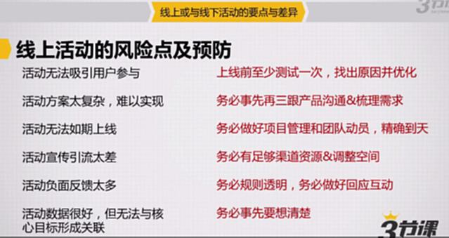
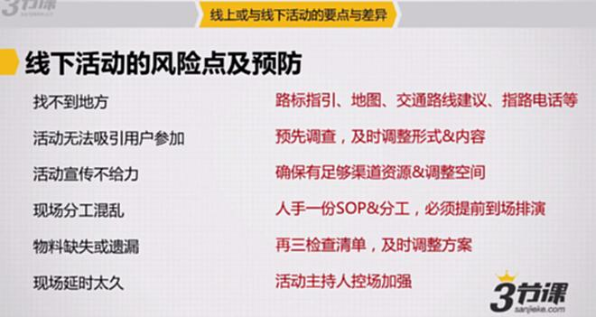
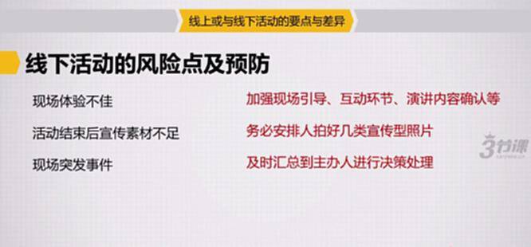

# S7.16：线上活动与线下活动的风险及预防

## 课程导读

活动运营存在各种风险,提前识别并制定应对方案,是活动成功的关键保障。本节系统讲解线上和线下活动的常见风险点及预防措施。

---

## 线上活动的风险点及预防

### 风险1:活动无法吸引用户参与

**应对方案:**
上线前至少测试一次,找出原因并优化

**预防措施:**
- 小范围测试
- 收集用户反馈
- 快速迭代优化
- A/B测试不同方案

---

### 风险2:活动方案太复杂,难以实现

**应对方案:**
务必事先再三跟产品沟通&梳理需求

**预防措施:**
- 提前技术评估
- 简化活动流程
- 分阶段实现功能
- 准备降级方案

---

### 风险3:活动无法如期上线

**应对方案:**
务必做好项目管理和团队动员,精确到天

**预防措施:**
- 制定详细排期
- 明确各环节负责人
- 定期进度检查
- 预留缓冲时间

---

### 风险4:活动宣传引流太差

**应对方案:**
务必有足够渠道资源&调整空间

**预防措施:**
- 渠道要有2-3种备份方案
- 预算方面可前期试水
- 如果出现意外,可换方案或宣传渠道
- 提前准备好Plan B

---

### 风险5:活动负面太多

**应对方案:**
务必规则透明,务必做好回应互动

**预防措施:**
- 活动规则清晰明确
- 建立快速响应机制
- 及时处理用户投诉
- 准备危机公关预案

---

### 风险6:活动数据很好,但无法与核心目标形成关联

**应对方案:**
务必事先想清楚

**预防措施:**
- 明确核心目标
- 设计关键指标
- 确保数据可追踪
- 建立数据关联分析

---

## 线下活动的风险点及预防

### 风险1:找不到地方

**应对方案:**
路标指引、地图、交通建议、指路电话等

**预防措施:**
- 提前发布详细地址
- 提供交通指南
- 设置明显路标
- 安排引导人员

---

### 风险2:活动无法吸引用户参加

**应对方案:**
预先调查,及时调整形式&内容

**预防措施:**
- 提前调研用户需求
- 设计有吸引力的内容
- 邀请知名嘉宾
- 设置激励措施

---

### 风险3:活动宣传不给力

**应对方案:**
确保有足够渠道资源&调整空间

**预防措施:**
- 多渠道组合推广
- 提前宣传造势
- 利用嘉宾影响力
- 设计可传播内容

---

### 风险4:现场分工混乱

**应对方案:**
人手一份SOP&分工,必须提前到场排演

**预防措施:**
- 制定详细SOP
- 明确人员分工
- 提前彩排演练
- 设置总协调人

---

### 风险5:物料缺失或者遗漏

**应对方案:**
再三检查清单,及时调整方案

**预防措施:**
- 建立物料清单
- 多方反复核对
- 准备备用物料
- 提前测试设备

---

### 风险6:现场延时太久

**应对方案:**
活动主持人控场加强

**预防措施:**
- 严格控制时间
- 准备缩短方案
- 主持人专业培训
- 设置时间提醒

---

---

### 风险7:现场体验不佳

**应对方案:**
加强现场引导、互动环节、演讲内容确认等

**预防措施:**
- 优化现场流程
- 培训服务人员
- 确认演讲内容
- 增加互动环节

---

### 风险8:活动结束后宣传素材不足

**应对方案:**
务必安排专人拍摄各类宣传型照片

**预防措施:**
- 安排专业摄影师
- 多角度多场景拍摄
- 拍摄用户反馈
- 记录精彩瞬间

---

### 风险9:现场突发事件

**应对方案:**
及时汇总到主办人进行决策处理

**预防措施:**
- 建立应急机制
- 明确决策流程
- 准备应急预案
- 保持沟通畅通

---

## 风险管理框架

### 风险识别

**常见风险来源:**
- 技术风险(线上)
- 执行风险(线下)
- 用户参与风险
- 外部环境风险
- 资源风险

### 风险评估

**评估维度:**
- 发生概率(高/中/低)
- 影响程度(严重/中等/轻微)
- 应对难度(难/中/易)

### 风险应对

**应对策略:**
- 规避:改变方案避免风险
- 降低:采取措施降低概率
- 转移:外包或保险
- 接受:准备应急预案

---

## 知识要点总结

### 线上活动风险预防

1. **技术风险** - 提前测试,多方验证
2. **进度风险** - 项目管理,严格控时
3. **流量风险** - 多渠道备份,灵活调整
4. **声誉风险** - 规则透明,快速响应
5. **数据风险** - 目标清晰,指标明确

### 线下活动风险预防

1. **场地风险** - 提前确认,充分准备
2. **人员风险** - 明确分工,充分演练
3. **物料风险** - 清单管理,反复核对
4. **流程风险** - SOP指导,严格控时
5. **应急风险** - 预案准备,快速响应

### 风险管理原则

- **预防为主** - 提前识别,提前准备
- **预案充分** - Plan B,Plan C
- **快速响应** - 及时处理,及时调整
- **总结复盘** - 提炼经验,持续改进
