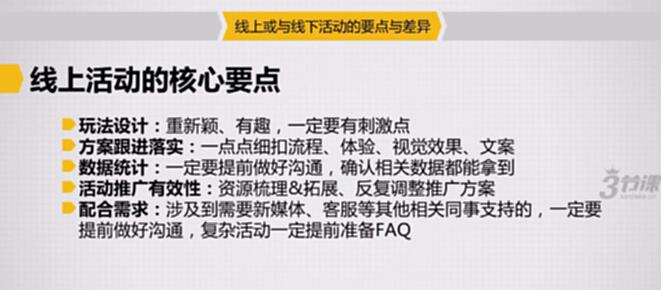
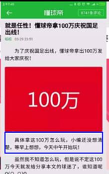
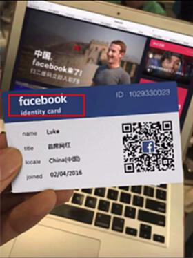
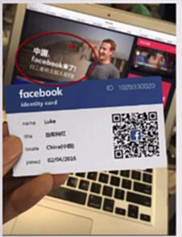
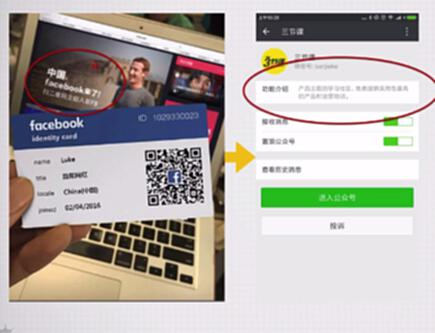
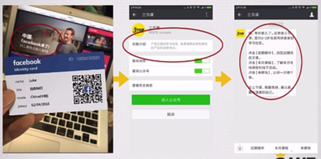

# S7.17：线上活动的核心执行要点实例讲解

## 课程导读

本节结合实际案例,讲解线上活动的核心执行要点,帮助你掌握线上活动运营的关键技巧。

---

## 线上活动的核心要点

### 1. 玩法设计

**要点:** 重新颖、有趣,一定要有刺激点

- 创意玩法吸引用户
- 设置激励提升参与
- 保持新鲜感持续运营
- 设计病毒传播点

---

### 2. 方案跟进落实

**要点:** 一点一点细抠流程、体验、视觉效果、文案

- 流程体验优化
- 视觉设计打磨
- 文案细节调整
- 用户测试反馈

---

### 3. 数据统计

**要点:** 一定要提前做好沟通,确认相关数据能拿到

- 提前数据埋点
- 明确数据需求
- 确保数据可追踪
- 建立数据看板

---

### 4. 活动推广有效性

**要点:** 资源梳理&拓展、反复调整推广方案

- 多渠道组合推广
- 根据数据调整策略
- A/B测试优化效果
- 预算合理分配

---

### 5. 配合需求

**要点:** 涉及到需要新媒体、客服等其他相关同事支持的,一定要提前做好沟通,复杂活动一定提前准备好FAQ

- 跨部门沟通协调
- 准备FAQ文档
- 培训相关人员
- 建立响应机制

---

## 案例分析

### 案例1:简书活动——神转折大赛

其实就是一个征文活动,但是没有标题写征文,而是写得好玩的地方。

**成功要素:**
- 创意标题吸引关注
- 有趣的玩法设计
- 低参与门槛
- 内容自发传播

---

### 案例2:懂球帝——100W庆祝国足出线

好奇心驱动

**成功要素:**
- 紧跟热点事件
- 情绪营造到位
- 数据可视化
- 引发用户共鸣

---

### 案例3:三节课——一秒入职Facebook

**细节优化:**

很多小心机是细节反复推敲的结果,见红色框框部分:

**文案引导优化:**

在公众号功能介绍里改成了活动玩法的引导:

**新关注用户引导语:**

关注引导语更改为活动内容引导:

---

## 核心数据需求

### 需要追踪的数据

**UV、生成量、关注数、分享数、取关量**

**需要开发统计的数据:**
- 生成量
- 分享数

**可从后台直接获取的数据:**
- UV
- 关注数
- 取关数

---

## 知识要点总结

### 线上活动执行要点

1. **玩法设计** - 新颖有趣,有刺激点
2. **方案落实** - 细抠流程、体验、视觉、文案
3. **数据统计** - 提前沟通,确保可追踪
4. **推广优化** - 资源梳理,反复调整
5. **配合支持** - 跨部门沟通,准备FAQ

### 成功关键

- **细节打磨** - 每个细节都反复推敲
- **数据驱动** - 用数据指导优化
- **快速迭代** - 根据反馈及时调整
- **跨部门协作** - 确保各方支持到位

---

## 拓展阅读

### 线上活动策划完整流程

**来源:** 知乎
**作者:** 韩叙

#### 活动运营的价值

- 吸引用户关注
- 拉动用户贡献
- 强化用户认知

#### 如何策划活动

**活动类型:**
- 补贴:滴滴和美团外卖的红包
- 话题:Keep的#我要上头条#、微博的#带着微博去旅行#
- 有奖:功夫熊猫3影评活动、贴吧的抽奖活动
- 游戏:支付宝集福、百度地图的#樱花甜筒跑酷#

**活动目的:**
- 拉新:新下单用户或APP的新启动用户
- 活跃:拉动访问登录和UGC的次数
- 促销:提升某款或某类商品的订单数
- 品牌:扩大品牌知名度和品牌辨识度

**切入需求:**
- 用户需求的场景:滴滴的春节拼车
- 用户关注的热点:微博的#汪峰上头条#
- 用户逐利的心理:O2O的满减活动

#### 策划活动的步骤

**1. 从目的出发**
把【目的】转化成一项【数据】
例如:APP希望提升用户规模→转化为提升DAU

**2. 确定目标和时间**
目标是把这个数据具体化
例如:把DAU提升50%或提升10W

**3. 策划活动形式**
做什么样的活动,这是活动策划的核心步骤

---

### 关键要点

**活动策划的完整性:**
1. 明确目标→数据化
2. 确定目标→具体化
3. 设计玩法→创意化
4. 执行推广→精细化
5. 数据复盘→持续化
