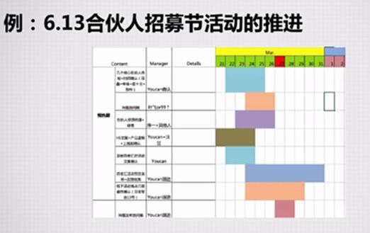
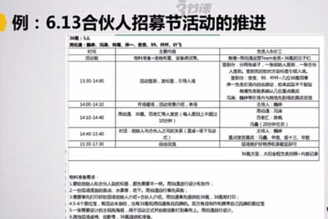
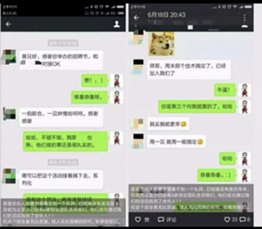
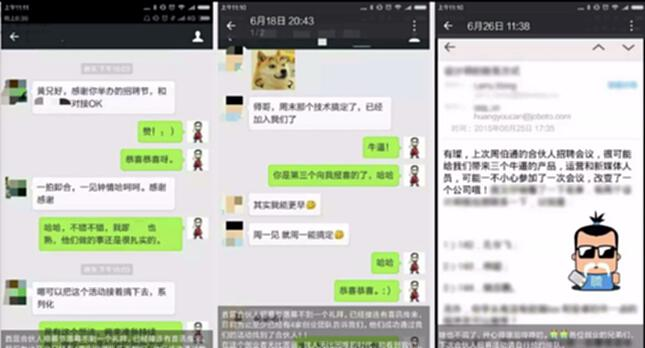
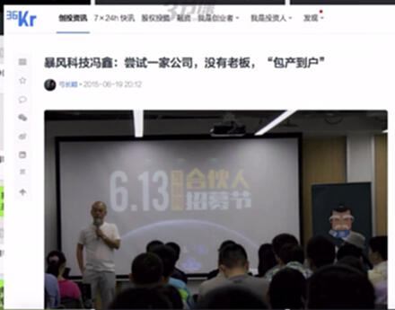
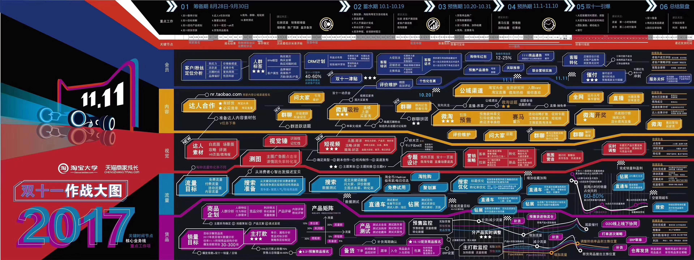

# S7.18：线下活动的核心执行要点实例讲解

## 课程导读

本节通过实际案例,讲解线下活动的核心执行要点,帮助你掌握线下活动运营的关键技巧。

---

## 线下活动的核心要点

### 1. 前期推进&筹备无差错

**要点:** 项目管理、信息同步、所有物料反复Check

- 制定详细项目计划
- 定期会议同步信息
- 物料清单反复核对
- 多方确认避免遗漏

---

### 2. 现场体验&秩序

**要点:** 现场分工明确、一人主Hold,每个环节单独有负责人

- 明确人员分工
- 设置总控负责人
- 每个环节专人负责
- 建立沟通机制

---

### 3. 活动传播

**要点:** 现场环节设计、邀请媒体曝光、收集寻找各种活动亮点进行传播

#### 3.1 现场环节设计

例如让现场用户转发集赞,以3小时为时限,或者集齐333个赞会给什么奖励

#### 3.2 邀请媒体曝光

市场公关部门维护媒体关系,或者公关发稿

#### 3.3 收集活动亮点

有意识地收集活动亮点,为后续传播做准备

---

## 案例分析:6.13合伙人招募节活动

### 活动推进机制

**每三天进行一次活动总结会议**

**会议内容:**
- 遇到的问题
- 需要何种帮助
- 信息同步
- 保证活动前期推进

---

### 活动当天秩序管理

**责任人、具体事项、物料清单、联系名录等都会详细展示**

**关键要素:**
- 详细的责任分工表
- 完整的物料清单
- 准确的时间节点
- 明确的联系人

---

### 活动后传播素材

**用户通过活动获得的实际帮助,这是后期宣传图片**

**传播要点:**
- 展示用户真实收获
- 用数据说话
- 视觉化呈现
- 便于分享传播

---

### 公关稿宣传

**名人借势**

**借势要点:**
- 邀请知名嘉宾
- 嘉宾背书提升 credibility
- 嘉宾社交传播
- 制造话题热度

---

## 知识要点总结

### 线下活动执行要点

#### 1. 前期筹备

- **项目管理**
  - 制定详细计划
  - 明确时间节点
  - 定期进度检查
  - 及时解决问题

- **信息同步**
  - 定期会议
  - 进展汇报
  - 问题反馈
  - 决策传达

- **物料准备**
  - 建立清单
  - 反复核对
  - 备用方案
  - 提前测试

#### 2. 现场执行

- **分工明确**
  - 总控负责人
  - 环节负责人
  - 职责清晰
  - 沟通顺畅

- **流程管控**
  - 严格控时
  - SOP指导
  - 应急预案
  - 快速响应

- **体验优化**
  - 引导清晰
  - 服务周到
  - 环境舒适
  - 互动有趣

#### 3. 传播放大

- **现场设计**
  - 分享机制
  - 互动环节
  - 话题制造
  - 内容产出

- **媒体关系**
  - 媒体邀请
  - 通稿发布
  - 名人借势
  - 传播扩散

- **素材收集**
  - 专业拍摄
  - 用户反馈
  - 数据记录
  - 亮点捕捉

---

## 成功关键

### 前期筹备

- **细致入微** - 每个细节都要考虑到
- **反复核对** - 多人多次检查确认
- **充分沟通** - 确保各方理解一致
- **预案准备** - 准备好Plan B

### 现场执行

- **统一指挥** - 一人总控,分工明确
- **严格执行** - 按照SOP执行不走样
- **快速响应** - 遇到问题及时处理
- **灵活调整** - 根据实际情况灵活应变

### 传播放大

- **提前策划** - 传播方案提前设计
- **专业执行** - 专业人员专业设备
- **多维度传播** - 图片、视频、文字全面覆盖
- **持续发酵** - 活动后持续传播

---

## 拓展阅读

### 小型活动完整Checklist

**来源:** 知乎
**作者:** 大猫布丁
**活动规模:** 20-200人
**预算:** 5000以内

#### 线下活动涉及的方面

1. **定下时间**
   - 避开冲突
   - 考虑天气
   - 确认场地可用

2. **确定预算**
   - 场地费
   - 物料费
   - 餐饮费
   - 礼品费

3. **确定场地**
   - 容量合适
   - 交通便利
   - 设施完善
   - 价格合理

4. **演讲者**
   - 邀请嘉宾
   - 确认时间
   - 收集PPT
   - 准备讲稿

5. **报名渠道**
   - 线上报名
   - 费用设置
   - 名额限制
   - 报名截止

6. **发布通知**
   - 宣传文案
   - 宣传渠道
   - 宣传节奏
   - 报名链接

7. **活动通知格式**
   - 时间地点
   - 活动流程
   - 嘉宾介绍
   - 注意事项

8. **现场人员名单**
   - 工作人员
   - 志愿者
   - 分工安排
   - 联系方式

9. **物料清单**
   - 签到物料
   - 宣传物料
   - 活动物料
   - 礼品物料

10. **现场时间表**
    - 签到时间
    - 开始时间
    - 各环节时长
    - 结束时间

11. **拍照注意**
    - 专业摄影师
    - 多角度拍摄
    - 抓拍精彩瞬间
    - 拍摄大合照

12. **礼物**
    - 纪念品
    - 伴手礼
    - 抽奖奖品
    - 嘉宾答谢

13. **活动策划**
    - 活动流程
    - 互动环节
    - 应急预案
    - 传播计划

14. **志愿者**
    - 招募培训
    - 分工安排
    - 激励措施
    - 感谢回馈

15. **PPT(Keynote)**
    - 收集PPT
    - 统一格式
    - 测试播放
    - 备份准备

**要点提示:**
- 每个细节都要列出
- 逐一检查确认
- 准备应急预案
- 提前彩排演练
