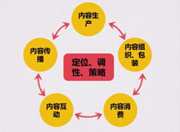
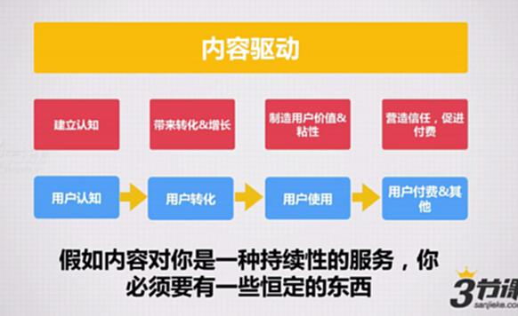
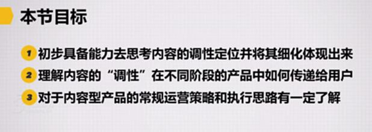
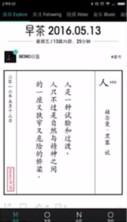
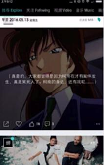
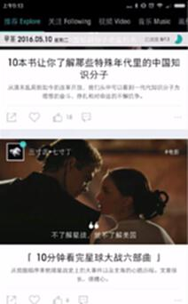
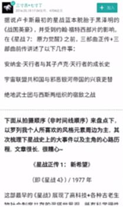
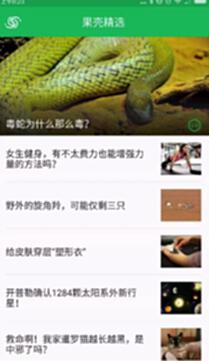
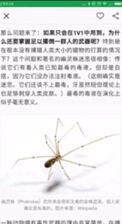
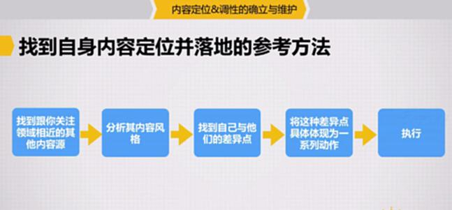

# S8.01：内容定位与调性概述

## 课程导读

本课程介绍内容的"定位"、"调性"以及内容运营的基本策略，帮助建立内容识别度，使微信公众号或内容型产品脱颖而出，持续获取用户注意力。

## 内容运营的核心环节

内容运营主要关注5个核心环节：

- **① 内容生产**
- **② 内容组织包装**
- **③ 内容消费**
- **④ 内容互动**
- **⑤ 内容传播**

其中，**定位、调性、策略**贯穿始终。

## 以内容为驱动的产品

当内容作为持续性服务时，必须具备恒定的特征。这些恒定特征就是**定位与调性**，或称为**价值主张**。

## 运营三部曲

- **定策略**
- **找资源**
- **做执行**

## 本节目标

1. 具备思考内容调性定位并将其细化体现的能力
2. 理解内容"调性"在不同阶段产品中的传递方式
3. 了解内容型产品的常规运营策略和执行思路

---

## 案例分析

### 案例1：MONO

**特点：首页具有人文关怀**

- 精美图片呈现

- 图文结合形式

- 内容认真严谨

### 案例2：果壳精选App

首页产品识别度相对较低，主要原因是内容风格不一致。

文章内容严谨，科普风格明显。

---

## 核心问题

**为何有的内容类产品能迅速让你产生深刻印象？**

## 做定位的要点

- 关注具体领域
- 风格独特
- 有细节支撑

## 找到内容定位并落地的参考方法

### ① 找到与你关注领域相近的其他内容源

### ② 分析其内容风格

### ③ 找到自己与他们的差异点

### ④ 将差异点具体体现为一系列动作

### ⑤ 执行

