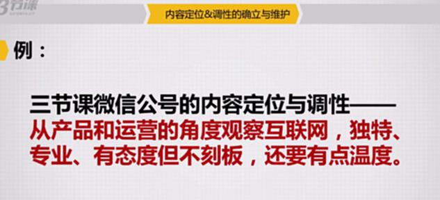
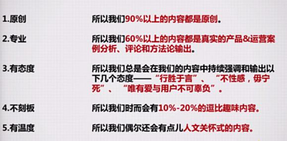

# S8.02：三节课实例：找到自己的独特“定位”

## 先想一下

回忆下你看过的三节课公众号文章，请描述下你认为三节课公众号内容有什么定位和调性，为什么？

想一想，然后看看老师怎么说——

## 三节课案例

### 三节课的定位

### 具体定位行为

1. **原创 ：**&#x6240;以我们90%以上的内容都是原创。

2. **专业：**&#x6240;以我们60%以上的内容都是真实的产品&运营案例分析、评论和方法论输出。

3) **有态度：**&#x6240;以我们总是会在我们的内容中持续强调和输出以下几个态度：“行胜于言”、“不性感，毋宁死”、“唯有爱与用户不可辜负”。

4) **不刻板：**&#x6240;以我们时而会有10%-20%的逗比趣味内容。

5. **有温度：**&#x6240;以我们偶尔还会有点儿人文关怀式的内容。例如：用户故事

