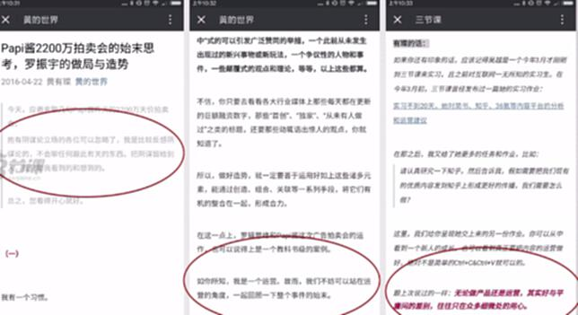
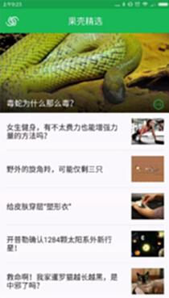
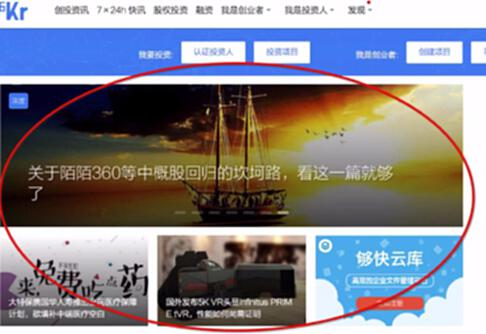

# S8.03：如何面向用户展现自己的“调性”？

## 先想一下

对照上一节给的三节课公证号调性，你认为它是否给你传达了这样的感觉，为什么？

## 如何面向用户维护好你的“调性”？

### ①内容量不大的情况下

* 注重单篇内容的风格、表达和价值导向

* 严格控制内容的构成比例：例如：主要突出专业，内容上60%以上都是专业内容。

**案例：画圈部分强调立场**

### ②内容量比较大的情况下

1. 注重内容的拣选、推荐

2. 控制不良内容的露出比例：例如，知乎，是利用折叠来控制不良比例，大部分用户觉得这个答案没帮助，就可以折叠了。

**案例：果壳精选app：死理性派、科普、死磕到底**

案例：36氪：行业资讯

## 拓展阅读

这里有课程中提及的两篇文章，点击链接快速阅读>>

1、[Papi酱2200万拍卖会的始末思考，罗振宇的做局与造势](http://blog.sanjieke.cn/article/127354.html)

2、[实习两个月后，关于如何更好刷爆知乎，这是她的答案](https://pan.baidu.com/s/1mhUuAKw?errno=0\&errmsg=Auth%2520Login%2520Sucess&\&bduss=\&ssnerror=0\&traceid=)

