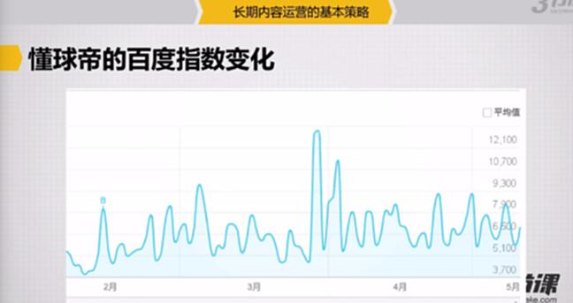
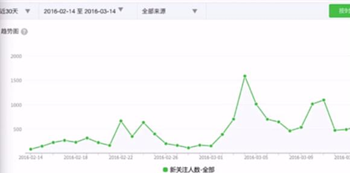
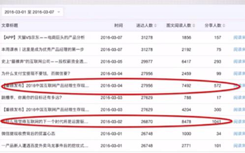
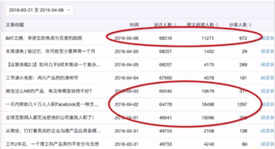
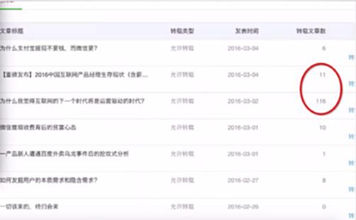
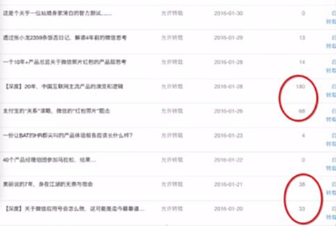
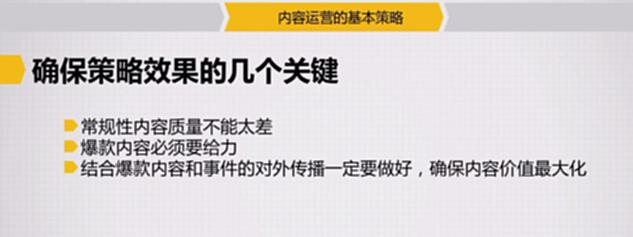
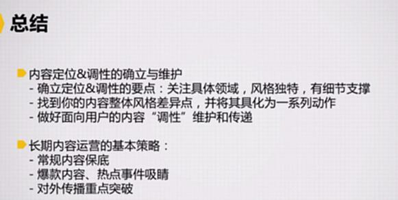

# S8.04：内容运营基本策略

## 核心问题

给内容定位并持续按照特定调性生产内容，用户是否会感到疲劳？

答案是需要运用策略来平衡。

## 内容生产和消费的两大原则

### 原则1：用户和生产者都容易产生疲劳

### 原则2：内容的爆发点往往来自事件和话题

## 长期内容运营的三大基本策略

### ① 常规性内容保底

**定位：** 核心内容，质量需达到60-70分以上

**作用：** 维持内容稳定性，确保持续输出

### ② 爆款内容、热点事件吸睛

**方法：** 定期或周期性推出热点/爆款文章吸引眼球，或将热点事件与内容关联，带动流量

**作用：** 制造话题，提升关注度

### ③ 对外传播重点突破

**方法：** 产出爆款内容后，在其他内容平台或媒体进行传播

**作用：** 扩大影响力，实现价值最大化

---

## 案例分析

### 案例1：懂球帝

用户关注度呈波浪式曲线，因为足球领域受赛事情况影响。

### 案例2：三节课微信公众号

从数据看，一个分享带来一个粉丝，转化效果可观。

**关键数据：** 微信单图文阅读量占总关注数的4-5%。

常规性内容被外部媒体转载的可能性较低，但爆款内容会带来大量转发：

---

## 确保策略效果的关键执行点

### ① 常规性内容质量不能太差

### ② 爆款内容必须给力（详见下一节课）

### ③ 结合爆款内容和事件的对外传播必须做好，确保内容价值最大化

---

## 总结

### 内容定位与调性的确立与维护

1. **确立定位与调性的要点：** 关注具体领域、风格独特、有细节支撑（包括字体大小、排版风格等）

2. **找到内容风格差异点，并将其具体化为一系列动作**

3. **做好面向用户的内容"调性"维护和传递**（根据内容量大小的不同采取不同做法）

### 长期内容的基本策略

1. **常规性内容保底**

2. **爆款内容、热点事件吸睛**

3. **对外传播重点突破**

---

## 拓展阅读

以下整理了"三节课"公众号过去半年内出品的8篇"爆款"内容，通过这些文章可以更明确地感知内容运营的基本策略。

1. [2016中国互联网产品经理生存现状全报告](http://blog.sanjieke.cn/article/117317.html)

2. 为什么我觉得互联网的下一个时代将是运营驱动的时代

3. BAT之痛：李彦宏的焦虑与百度的困局

4. 一天内帮助几十万人入职Facebook是一种怎样的体验？【附案例干货详解】

5. 全球互联网人都无法拒绝的公司邀我入职了！

6. 【深度】20年，中国互联网主流产品的演变和逻辑

7. 美丽说的7年，身在江湖的无奈与宿命

8. 【深度】关于微信应用号会怎么做，这可能是迄今最靠谱的猜测

