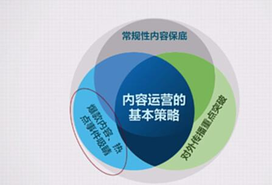
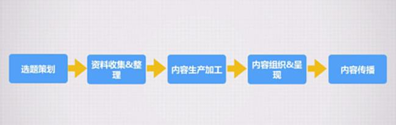
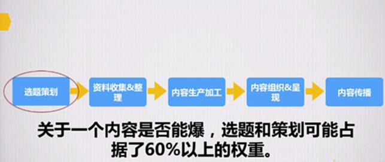

# S8.05：内容选题和策划的意义

## 课程导读

对于内容运营人员而言，策划爆款内容带动关注度增长是日常工作的核心目标。

内容引爆并不容易，但有规律可循。选题策划在其中作用显著，一个内容能否成为爆款，选题和策划的权重占比超过60%。

## 爆款内容策划回顾

回顾上节课提到的内容运营基本策略：

1. **常规性内容保底**
2. **爆款内容、热点事件吸睛**
3. **对外传播重点突破**

## 打造爆款文章与传播的基本流程

1. **选题策划**

2. **资料收集与整理**

3. **内容生产加工**

4. **内容组织与呈现**

5. **内容传播**

## 本节课目标

1. 了解爆款内容的选题策划流程和常见选题方向
2. 了解爆款内容的写作思路和方法
3. 初步具备通过自主选题策划和制作，产出60分以上内容的能力

## 选题策划的意义

在整个爆款内容打造过程中，选题策划的重要性超过60%。

