# S8.06：8个常见的内容选题策划方向（重点）

## 环节1：选题策划：8个常见选题和策划内容

### 方向1：对知名对象的吐槽

### 方向2：对经典案例、知名对象的深度分析、解读：正面、严肃分析

### 方向3：颠覆式认知式观点、论点

### 方向4：热点事件的差异化解读、分析：热点要不足够快，要不足够不同。

### 方向5：数据、盘点、预言类

### 方向6：共鸣性问题解读：比如疑问

### 方向7：与大众喜闻乐见的娱乐性话题关联

### 方向8：精彩故事、段子、不可思议类：情节上的转折和翻转

**案例：方向1：**&#x5BF9;知名对象的吐槽：对支付宝的吐槽

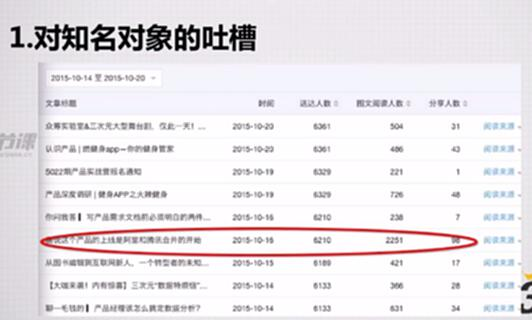

**吐槽微信不好的地方**

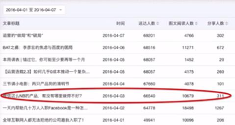

**案例：方向2：**&#x5BF9;经典案例、知名对象的深度分析、解读

对懂球帝的分析，对入职FacebookH5的案例分析

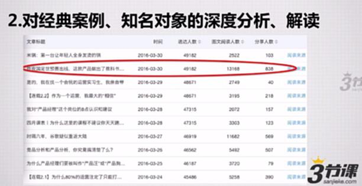

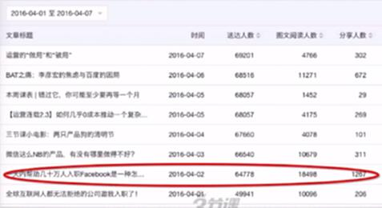

针对BAT的局面和问题进行了深度分析的

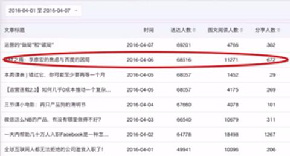

**案例：方向3：**&#x98A0;覆式认知式观点、论点

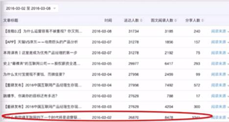

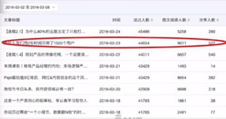

**案例：方向4：**&#x70ED;点事件的差异化解读、分析：热点要不足够快，要不足够不同。

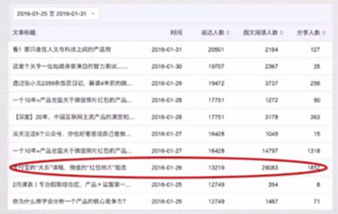

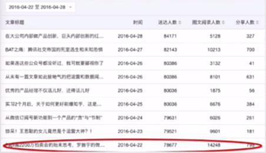

**案例：方向5：**&#x6570;据、盘点、预言类

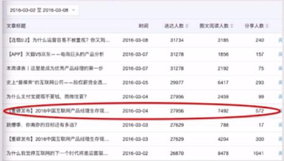

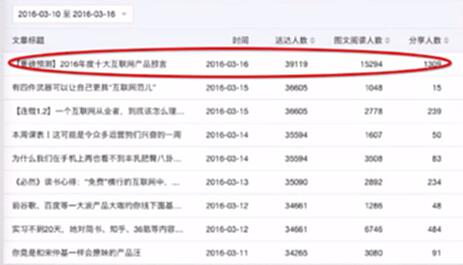

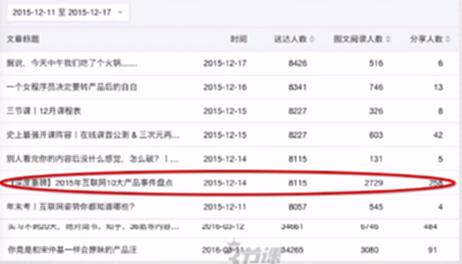

**案例：方向6：**&#x5171;鸣性问题解读

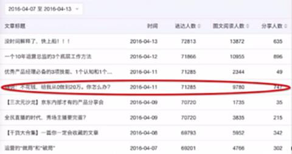

**案例：方向7：**&#x4E0E;大众喜闻乐见的娱乐性话题关联

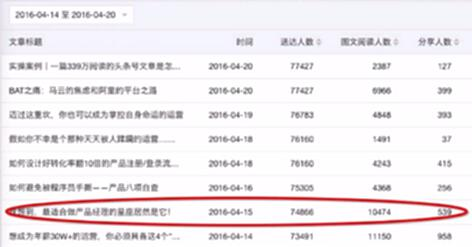

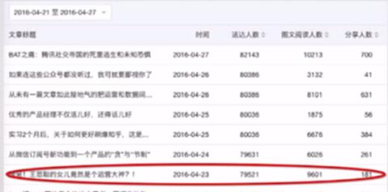

**案例：方向8：**&#x7CBE;彩故事、段子、不可思议类

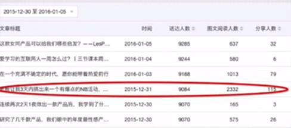

### 问题：每个方向具体的展开的内容会有哪些？

## 拓展阅读

视频中提到一些文章，都是一些典型案例，你可以点击链接获取文章>>

1. 据说这个产品的上线是阿里和腾讯合并的开始

据说这个产品的上线是阿里和腾讯合并的开始

2. 微信这么NB的产品，有没有哪里做得不好？

微信这么NB的产品，有没有哪里做得不好？

3. 昨夜国足世预赛出线，这款产品做出了教科书般的经典运营案例

昨夜国足世预赛出线，这款产品做出了教科书般的经典运营案例

4. 一天内帮助几十万人入职Facebook是一种怎样的体验？【附案例干货详解】

一天内帮助几十万人入职Facebook是一种怎样的体验？【附案例干货详解】

5. BAT之痛：李彦宏的焦虑与百度的困局

BAT之痛：李彦宏的焦虑与百度的困局

6. 为什么我觉得互联网的下一个时代将是运营驱动的时代？

为什么我觉得互联网的下一个时代将是运营驱动的时代？

7. 为什么我们用3年时间只做了1500个用户

为什么我们用3年时间只做了1500个用户

8. 支付宝的“关系”谋略，微信的“红包照片”狙击

支付宝的“关系”谋略，微信的“红包照片”狙击

9. Papi酱2200万拍卖会的始末思考，罗振宇的做局与造势

Papi酱2200万拍卖会的始末思考，罗振宇的做局与造势

10.  【重磅发布】2016中国互联网产品经理生存现状盘点（含薪资、从业分布等N多维度）

 【重磅发布】2016中国互联网产品经理生存现状盘点（含薪资、从业分布等N多维度）

11. 【重磅预测】2016年度十大互联网产品预言

【重磅预测】2016年度十大互联网产品预言

12. 【深度重磅】2015年互联网10大产品事件盘点（上）

【深度重磅】2015年互联网10大产品事件盘点（上）

13. 【深度重磅】2015年互联网10大产品事件盘点（下）

【深度重磅】2015年互联网10大产品事件盘点（下）

14. Ta说：不花钱，给我从0做到20万。你怎么办？

Ta说：不花钱，给我从0做到20万。你怎么办？

15. 妹想到，最适合做产品经理的星座居然是它！

妹想到，最适合做产品经理的星座居然是它！

16. 惊呆！王思聪的女儿竟然是个运营大神？！

惊呆！王思聪的女儿竟然是个运营大神？！

