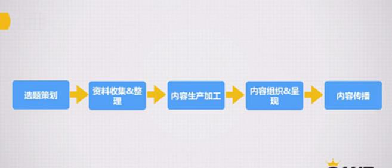
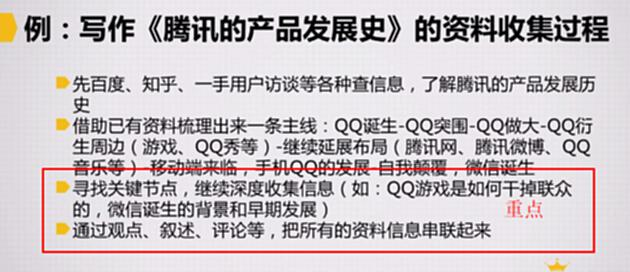

# S8.07：案例 - 如何高效收集写作资料与素材

## 引导问题

如果接到选题"腾讯的产品发展史"，应该如何着手写作？如何收集资料和素材？

## 资料收集与整理

### 资料收集渠道

- **搜索引擎**（百度、Google等）
- **网络社区/论坛**（知乎、豆瓣等）
- **媒体平台**
- **行业数据库**（如IT橘子）
- **一手访谈**（产品用户、产品经理、负责人等）

### 收集方法

**先整理背景，再梳理内容脉络，最后有针对性地收集信息。**

---

## 案例：《腾讯的产品发展史》资料收集过程

### 步骤1：初步了解

通过百度、知乎、一手用户访谈等渠道，了解腾讯的产品发展历史。

### 步骤2：梳理主线

借助已有资料梳理出发展脉络：

**QQ诞生 → QQ突围 → QQ做大 → QQ衍生周边（游戏、QQ秀等） → 继续延展布局（腾讯网、腾讯微博、QQ音乐等） → 移动端来临，手机QQ发展 → 自我颠覆，微信诞生**

### 步骤3：深度收集关键节点信息

**写作内容的关键点：**

- QQ游戏如何超越联众
- 微信诞生的背景和早期发展

### 步骤4：串联整合

通过观点、叙述、评论等，将所有资料信息串联起来形成完整内容。

---

## 拓展阅读

点击链接阅读课程中提及的文章：

【深度策划】腾讯的18年产品史——从"狗日的"腾讯到最受人尊敬的产品帝国
