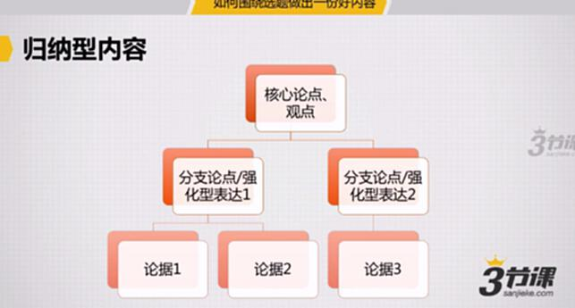
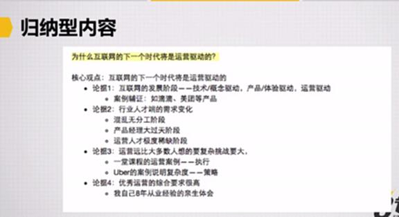
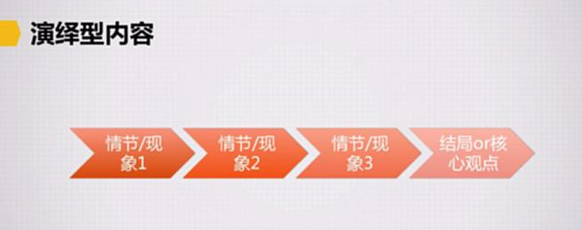
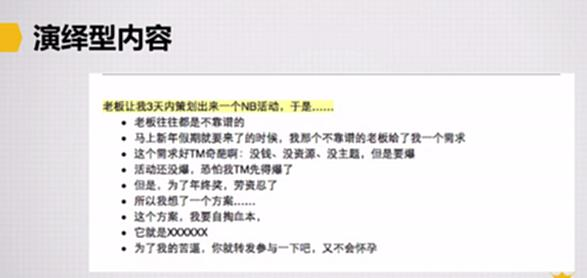

# S8.08：两类内容写作提纲拟定

## 环节2：资料收集与整理

### 拟定写作内容类型与提纲

#### 1. 归纳性内容：金字塔结构

**结构组成：**

- **核心论点、观点**
- **分支论点/强化型表达**
- **论据**

**案例：**

#### 2. 演绎型内容：线性结构

演绎型内容主要通过情节和故事起伏推进，最后呈现结局或核心观点。

**结构流程：**

情节/现象1 → 情节/现象2 → …… → 结局/核心观点

**案例：**

---

## 问题探讨

归纳和演绎内容的具体展开内容如何写作？

## 拓展阅读

点击阅读视频中提及的文章：

1. 为什么我觉得互联网的下一个时代将是运营驱动的时代？

2. 老板让我3天内搞出来一个有爆点的NB活动，于是……

