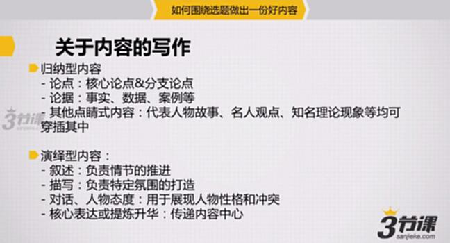
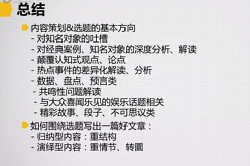

# S8.09：总结 - 内容写作方法

## 环节3：内容生产与加工

### 归纳型内容

**核心要素：**

- **论点：** 核心论点与分支论点
- **论据：** 事实、数据、案例等
- **点睛内容：** 代表人物故事、名人观点、知名理论现象等可穿插其中

### 演绎型内容

**核心要素：**

- **叙述：** 负责情节推进
- **描写：** 负责特定氛围营造
- **对话、人物态度：** 用于展现人物性格和冲突
- **核心表达或提炼升华：** 传递内容中心思想

---

## 总结

### 内容策划与选题的基本方向

1. **对知名对象的吐槽**
2. **对经典案例、知名对象的深度分析、解读：** 正面、严肃分析
3. **颠覆式认知观点、论点**
4. **热点事件的差异化解读、分析：** 热点要足够快或足够不同
5. **数据、盘点、预言类**
6. **共鸣性问题解读：** 如疑问类
7. **与大众喜闻乐见的娱乐性话题关联**
8. **精彩故事、段子、不可思议类：** 情节上的转折和翻转

### 如何围绕选题写出一篇好文章

- **归纳型内容：** 重结构
- **演绎型内容：** 重情节、转圜

