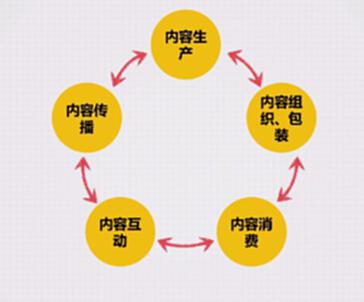
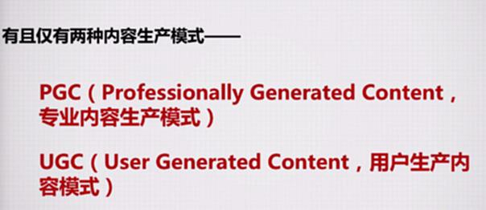
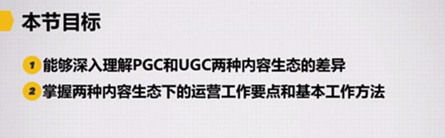
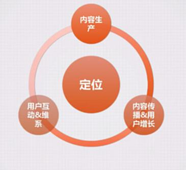
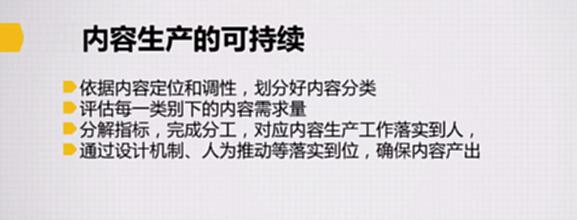
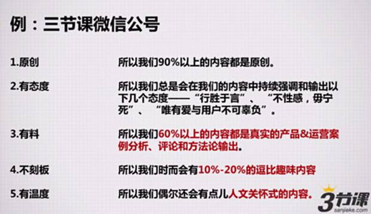
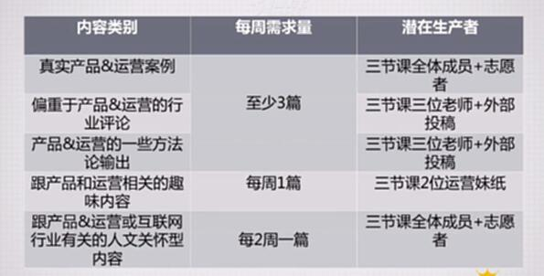
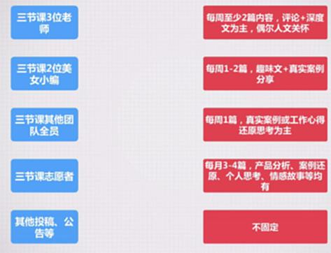
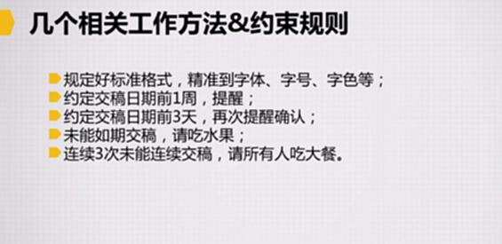
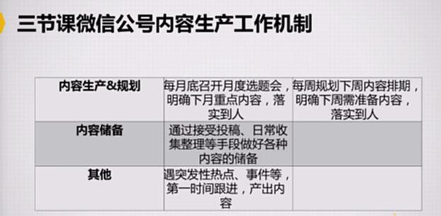

# S8.10：两种内容生态与PGC生态的内容生产

## 课程导读

上一章，我们讲了内容的选题策划和爆款内容的打造。接下来我们要聊的话题是：如何让你的内容生产成为一件良性可持续的事？

有人可能知道，在互联网的世界里，有且只有两种内容生产模式：PGC和UGC。

这堂课，我们会具体来聊聊，PGC型内容生态和UGC型的内容生态有何差异，以及围绕着要让它们的内容生产变得可持续，或是让它们的内容可以更好对外进行传播，我们的关注点和侧重点又该有那些不同？

## 如何搭建一个稳定可持续的内容生态？

### 什么是生态？

包括5个部分：内容生产、内容组织&包装、内容消费、内容互动、内容传播

生态就是这5部分内容可以循环起来。

### 如何让这个过程变得具有持续性？

### 内容生产生态模式有且仅有两种模式

PGC（Professionally Generated Content）专业内容生产模式

UGC（User Generated Content）用户生产内容模式

## 本节目标

* **能够深入理解PGC和UGC两种内容生态的差异**

* **掌握两种内容生态下的运营工作要点和基本工作方法**

## PGC内容生态包含内容

* **内容生产**

* **内容传播&用户增长**

* **用户互动&维系**

* **核心还是定位**

### ①PGC的内容生产可持续

* 依据内容定位和调性，划分好内容分类

* 评估每一类别下的内容的需求量

* 分解指标，完成分工，对应内容生产工作落实到人

* 通过设计机制、人为推动等落实到位，确保内容产出

**细节内容：几个相关工作方法&约束规则**

* 规定好标准格式，精确到字体、字号、字色等；

* 约定交稿日期前1周，提醒；

* 约定交稿日期前3天，再次提醒确认；

* 未能如期交稿，请吃水果；

* 连续3次未能交稿，请所有人吃大餐。

案例：三节课公众号

第一步内容定位和调性，划分好

每个类别的具体数量

分解指标，安排任务

推动机制：几个相关工作方法&约束规则

**三节课公众号内容生产工作机制**

