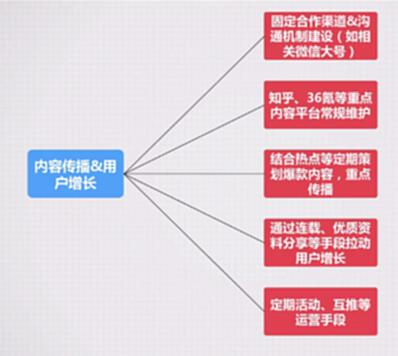
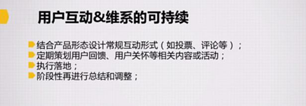

# S8.11：PGC生态下的内容维系与用户增长

## 思考问题

三节课公众号属于PGC生态还是UGC生态？为什么？

## PGC内容生态的构成要素

### PGC的内容传播与用户增长可持续性

#### 工作方法

**1. 工作拆解与标准化**

- 将相关工作内容进行拆解并尽量标准化
- 例如：内容传播中联系外部公众号宣传，需要标准化流程

**2. 责任分配到人**

- 明确谁负责知乎传播，谁负责公众号传播

**3. 执行落地**

**4. 阶段性总结与调整**

- 以季度或月为单位进行调整

#### 案例：三节课

- **固定渠道合作：** 如何维系关系、内部合作联系人、联系方式、合作标准
- **平台传播渠道维护：** 知乎、36氪等内容传播需要专人负责
- **集合热点、爆款重点传播：** 专人负责流程、发布平台等
- **用户增长：** 通过连载、优质资源拉动用户增长，需要专人跟进
- **定期活动、互推：** 需要专人负责

---

### PGC的用户互动与维系可持续性

#### 工作方法

**1. 结合产品形态设计常规互动形式**

- 不同产品的互动形式不同
- 例如：投票、评论等
- 每篇文章后设置投票机制，每条评论都回复

**2. 定期策划用户回馈、用户关怀活动**

- 例如：福利、彩蛋等

**3. 执行落地**

**4. 阶段性总结与调整**

