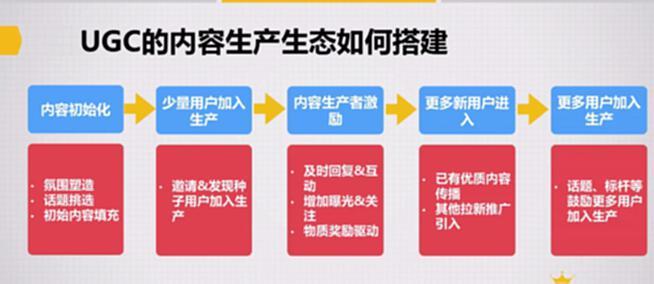

# S8.12：如何搭建UGC类型的内容生态

## 思考问题

PGC型内容生态和UGC型内容生态，哪种更复杂？为什么？

## UGC内容生产生态搭建流程

由于内容来自用户，从控制角度存在较大难度。

### 第1环节：内容初始化

- **氛围塑造**
- **话题挑选**
- **初始内容填充**

### 第2环节：少量用户加入生产

- **邀请与发现种子用户加入生产**

需要投入大量精力时间发现他们，并建立强联系。

### 第3环节：内容生产者激励 - 建立种子用户持续生产习惯

- **及时回复与互动**
- **增加曝光与关注**
- **物质奖励**

### 第4环节：更多新用户进入

- **已有优质内容传播**
- **其他拉新推广引入**

### 第5环节：更多用户加入生产

- **话题、标杆等鼓励更多用户加入生产**

开放部分空间，让更多用户参与进来。

---

## 核心要点

**UGC生态的优势：** 一旦建立起来，相对稳固，不易垮掉。

**PGC生态的特点：** 一分耕耘一分收获，付出和收获对等。
