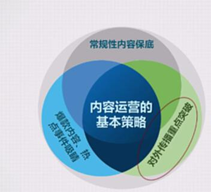
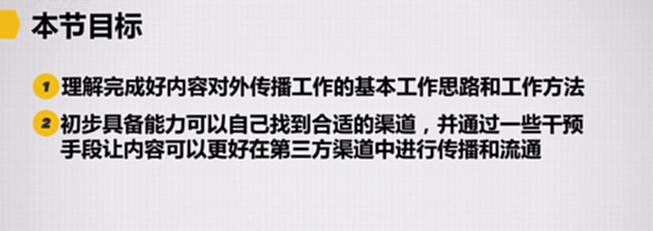
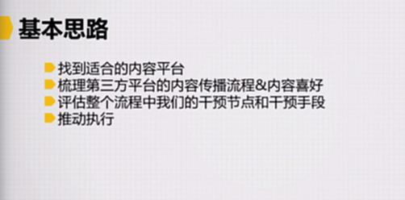

# S8.14：内容传播的基本思路

## 课程导读

上一章讲解了内容生产体系的构建。本章重点介绍内容的对外传播。

如前所述，在拥有优质内容的前提下，内容的"对外传播"是整个内容运营策略中必不可少的一环。

特别是在早期，几乎不可能花钱做传播，只能尽量通过免费方式进行传播。这正是本章课程的重点内容。

## 如何0成本做好内容对外传播

### 基本策略

## 本节目标

- **理解完成好内容对外传播工作的基本思路和方法**
- **初步具备能力找到合适渠道，通过干预手段让内容在第三方渠道更好传播**

---

## 1. 打通内容对外传播通道的基本思路

**重点解决问题：** 有了好内容之后，如何不花成本地传播出去。

### 核心步骤

1. **找到适合的内容平台**
2. **梳理第三方平台的内容传播流程与内容喜好**
3. **评估整个流程中的干预节点和干预手段**
4. **推动执行**

