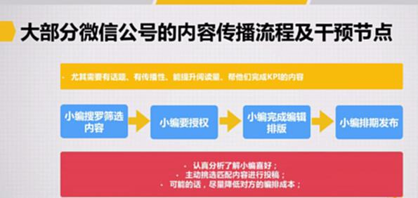
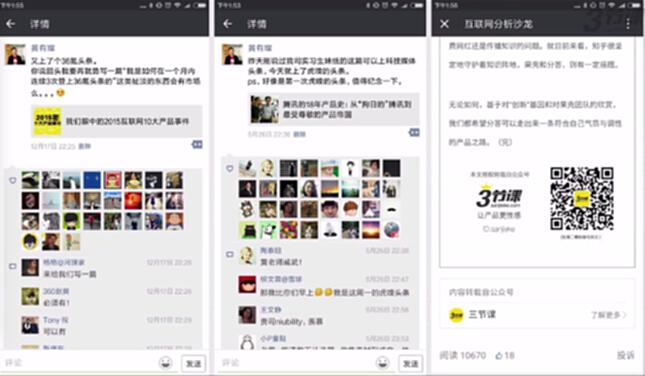

# S8.15：三节课在微信端的对外内容传播实例

## 思考问题

结合上一节的四个工作步骤，如果有一篇《我们眼中的2015互联网10大产品事件》是三节课公众号的内容，想推荐给其他微信大号，第一步应该怎么做？

## 三节课的对外传播实践

### 第1步：找到适合内容传播的渠道

**其他微信大号：**
- 新榜
- 3W深度精选
- 互联网思维
- 互联网分析沙龙

**其他平台：**
- 知乎、简书、36氪、虎嗅、百度百家等

---

### 第2、3步：微信公众号的内容传播流程和干预节点

#### ① 微信大号喜欢的内容

**核心标准：**
- 需要有话题性
- 具备传播性
- 能提升阅读量
- 帮助完成KPI

**个别偏好：**
- 行业动态、商业模式解读
- 偏好落地实操内容，不喜欢宏观论述

#### ② 可干预的环节

小编搜罗和筛选内容 → 小编授权 → 小编完成编辑排版 → 小编排期发布

#### ③ 其他重要事项

- **认真分析了解小编喜好**
- **主动挑选匹配内容进行投稿**
- **尽量降低对方的编排成本**

例如：了解对方的编排习惯，将自己的文章编排格式调整得相近，可以节省对方的编排成本。

#### 真实转载案例

