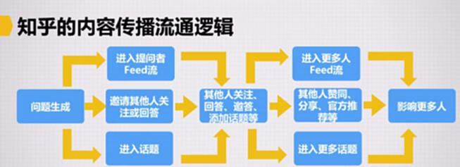
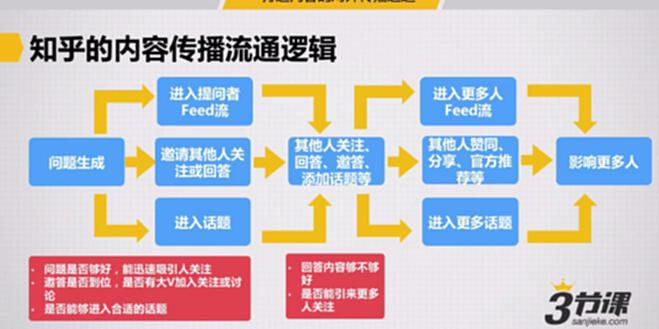
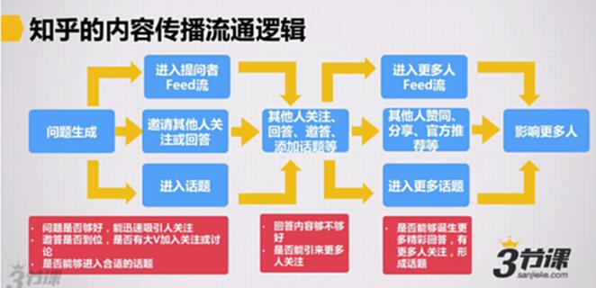
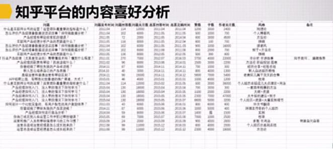
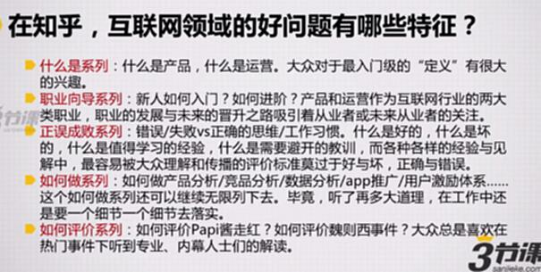
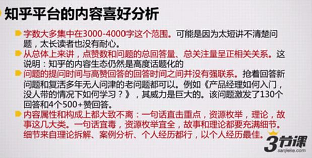
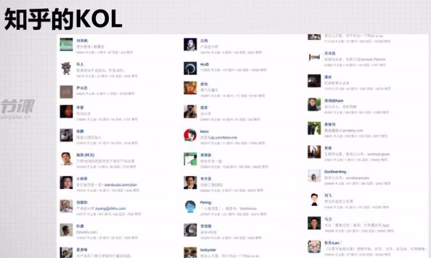

# S8.16：三节课在知乎的对外内容传播实例

## 知乎内容传播实际案例

### 案例一：《互联网业内人对2016年中国互联网的发展趋势有什么预测？》

- **98个赞，问题1235人关注**
- 自己提出的问题，产出相对一般，采用自问自答形式

### 案例二：《做互联网产品运营需要具备哪些素养或知识》

- **128个赞，问题2185人关注**

### 案例三：《怎样理解雷军说的【你不要用战术上的勤奋掩盖战略上的懒惰】？》

- **2347个赞，问题15137人关注**

---

## 知乎内容传播流通逻辑

### 待整理笔记

---

## 知乎平台内容喜好分析

基于30多个内容的分析，筛选条件为：

- **回答内容至少500个赞以上**
- **问题关注度在3000以上**

---

## 互联网领域好问题的特质

### 1. "什么是"系列

- 什么是产品，什么是运营
- 大众对入门级"定义"有很大兴趣

### 2. 职业向导系列

- 新人如何入门？如何进阶？
- 产品与运营作为互联网行业的两类职业，职业发展与未来晋升之路吸引从业者关注

### 3. "正误成败"系列

- 错误/失败 vs 正确思维/工作习惯
- 什么是好的、坏的，值得学习的经验，需要规避的教训
- 最容易被大众理解和传播的评价标准：好与坏、正确与错误

### 4. "如何做"系列

- 如何做产品分析/竞品分析/数据分析/app推广/用户激励体系

### 5. "如何评价"系列

---

## 知乎平台回答分析

### 内容特征

- **字数集中在3000-4000字范围**
  - 太短无法讲清楚问题
  - 太长读者没有耐心

- **点赞数与问题的总回答量、总关注量呈正相关**
  - 说明知乎的内容生态仍然是高度话题化的

- **问题提问时间与高赞回答时间无强联系**
  - 抢着回答新问题
  - 复活多年无人问津的老问题都是可行的

- **内容属性和构成大致包含以下几类：**
  - 一句话直击重点（犀利性）
  - 资源枚举（全面性）
  - 理论（拆解、案例分析）
  - 故事（自己的经历）

---

## 知乎的KOL

### 邀请大V的私信要点

- **亲和**
- **中肯**
- **有自己的见解**

## 如果有大V回答你的问题，可以进行二次传播

