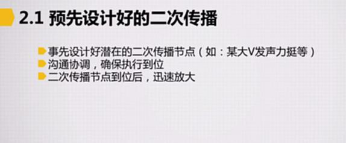
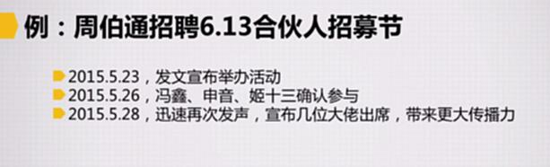
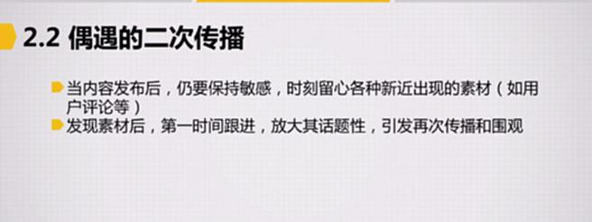
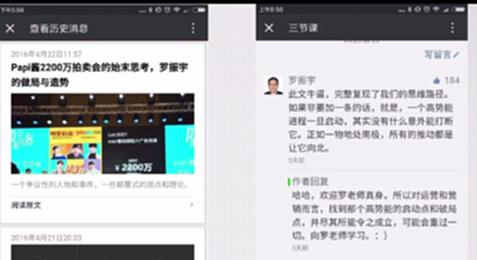
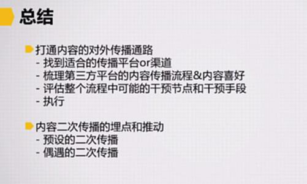

# S8.17：内容二次传播的埋点与推动

## 二次传播定义

二次传播就是内容已经出现在某个渠道或者平台后，通过我们人为的干预引发新一轮的传播。

## 预先设计好的二次传播

* 事先设计好潜在的二次传播节点（如：某大V发声力挺等）

* 沟通协调，确保执行到位

* 二次传播节点到位后，迅速放大

案例：周伯通招聘6.13合伙人招募节

## 偶遇的二次传播

* 当内容发布后，仍要保持敏感，时可要留心各种新近出现的素材（如用户评论等）

* 发现素材，第一时间跟进，放大其话题性，引发再次传播和围观

**案例：有名人评论**

## 总结

### 打通内容的对外传播通路

* 找到适合的传播平台or渠道

* 梳理第三方平台的内容传播流程&内容喜好

* 评估整个流程中可能的干预节点和干预手段

* 执行

### 内容二次传播的埋点和推动

* 预设的二次传播

* 偶遇的二次传播

