# S8.18：文案的重要性与常见形式

## 课程导读

80%文案的目的，都是为了提高转化率。这类文案，我们叫做“转化型文案”。包括文章标题、推广软文等等，都算是转化型文案。

我知道，很多人在撰写这类文案时，都是缺乏思路和方法的，甚至会有人说，文案这个事，就是天赋。

然而真相并非如此。事实上，如果你想从60-70分提升到90分，这确实取决于你的天赋和长期积累、练习。但，如果只是想从0到60-65分的话，是存在一些工作方法和思路可以给你帮助的。

## 如何写好转化率翻10倍的标题和文案

### 工作哪些部分会涉及文案内容

文案是一个运营最基本的基本功之一

案例：微信群，求转发

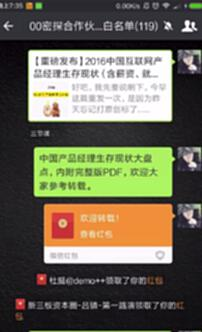

课程标题+课程介绍：文案

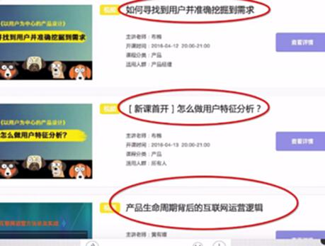

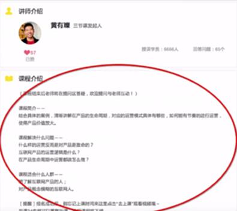

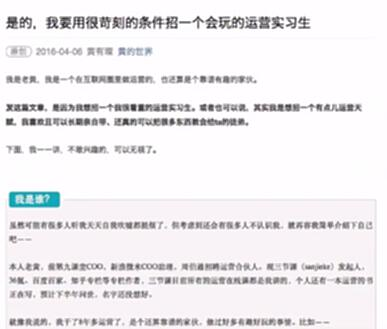

## 本节目标

* **对于文案的价值和意义具备深入理解**

* **掌握3-4种已转化率为目标的文案写作方法&技巧**

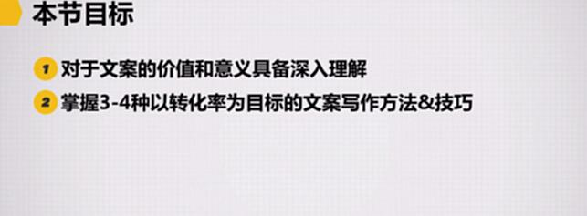

## 一个好文案的两重潜在作用：引发传播和制造转化

案例：小马宋：2013年的文案内容

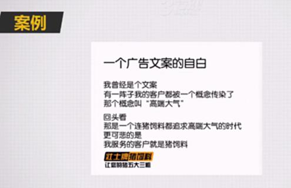

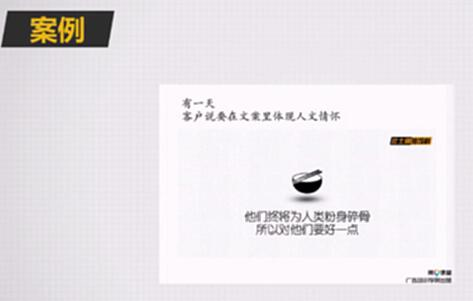

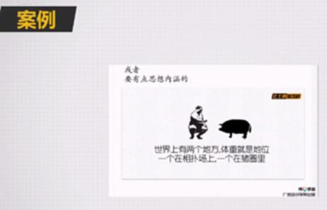

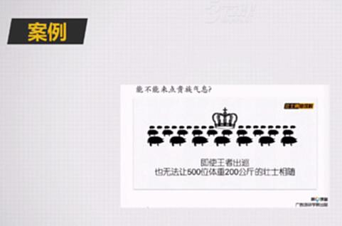

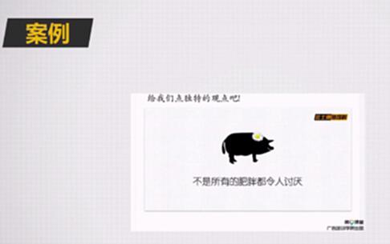

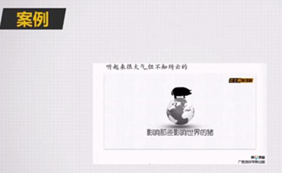

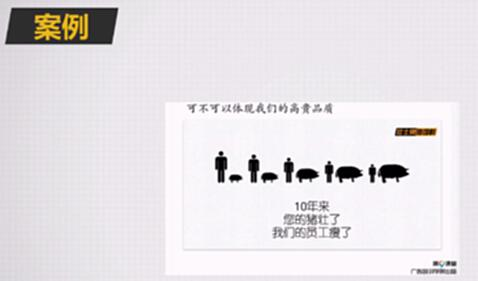

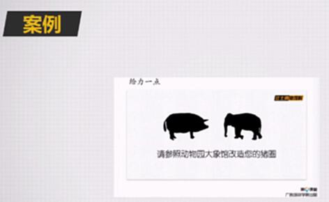

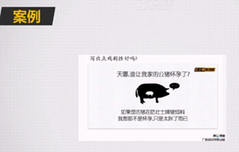

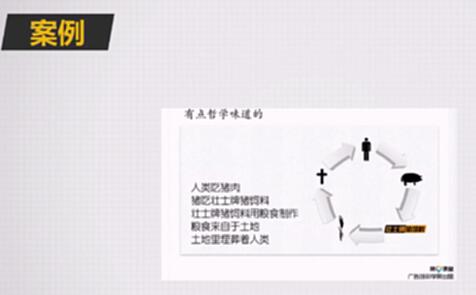

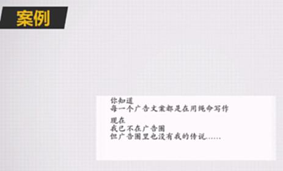

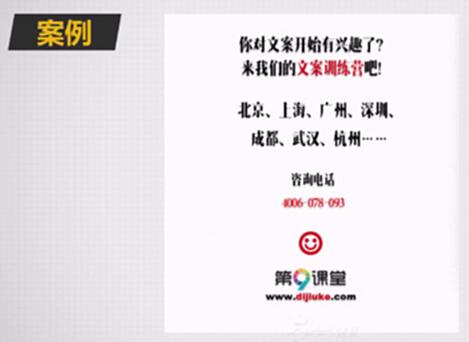

## 传播型文案（并不是本节课重点）

胜在故事性、有力的观点或者出人意料的情节、除了大量练习和积累，难有捷径。

## 制造转化型文案（重点）

### 文案的转化是怎么形成的？

* **文案：传递产品价值、促成行动**

* **文案：突出卖点、撬动欲望**

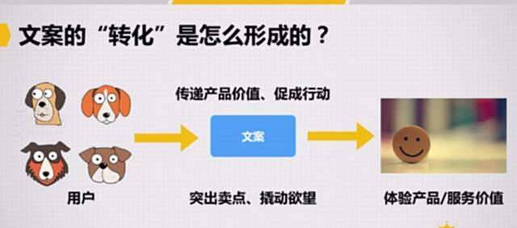

### 一个文案可以带来多大的转化差距？

案例：

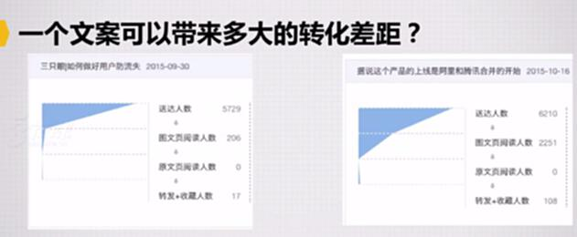

### 转化的两个层次（重点）

1、建立认知

2、激发兴趣

通常情况下，只有先建立起认知，你才有机会激发用户的兴趣。

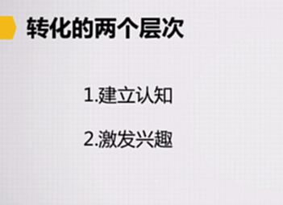

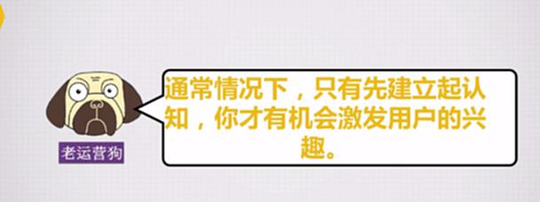

### 撰写文案底线

**要注意，文案营造出的预期和后续价值最好尽量保持一致，不要过于夸大。**

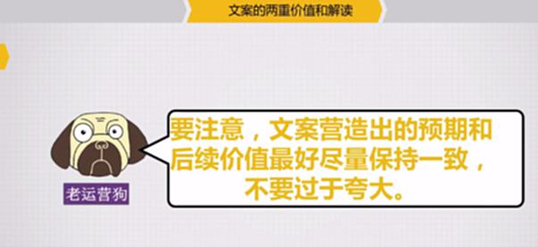

### 突破底线的例外：除非能制造反差性的趣味。

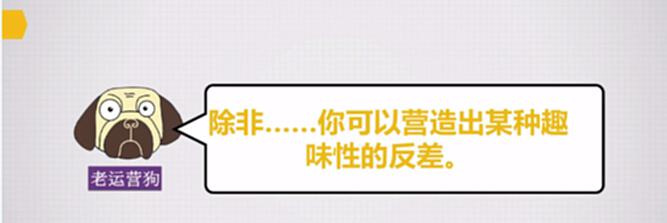

**案例：**

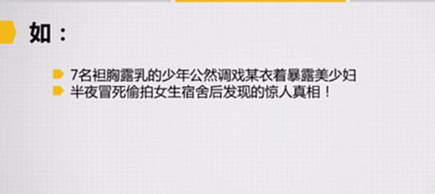

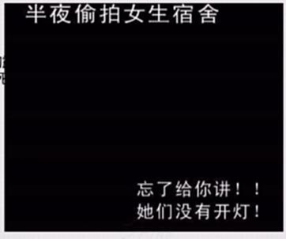

## 拓展阅读

点击以下链接获取相关文章：

据说这个产品的上线是阿里和腾讯合并的开始

据说这个产品的上线是阿里和腾讯合并的开始

