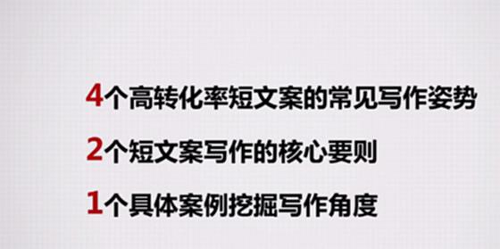
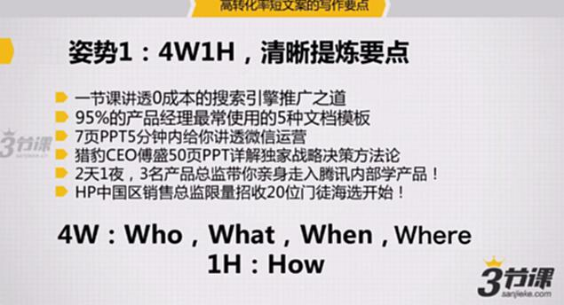
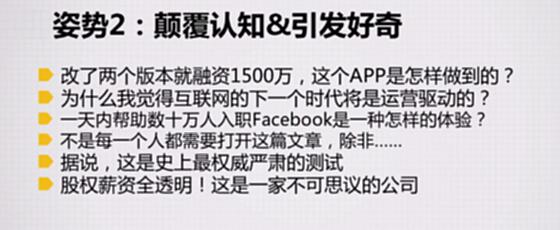
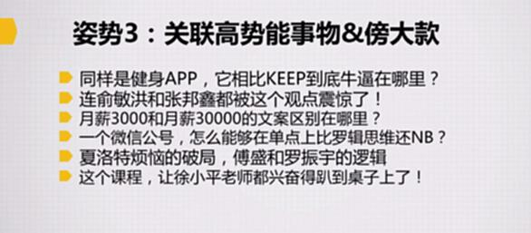
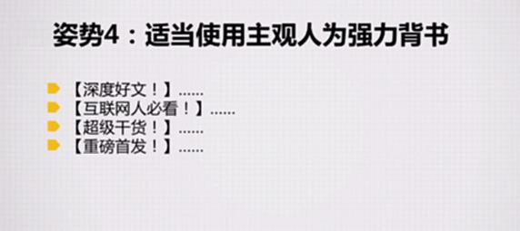

# S8.19：提高转化率的4个短文案写作方法

## 本节目标

- **掌握4个高转化率短文案的常见写作方法**
- **理解2个短文案写作的核心原则**
- **学习1个具体案例挖掘写作角度**

---

## 4个高转化率短文案的常见写作方法

### 方法1：4W1H，清晰提炼要点

#### 4W要素

- **Who（谁）：** 谁来讲、讲给谁听、给谁看
- **What（什么）：** 讲的到底是什么东西
- **Where（哪里）：** 这个东西可能与什么地方或空间有关
- **When（何时）：** 在多长时间内讲清楚

#### 1H要素

- **How（如何）：** 怎么能带给你价值

拿到一个内容，可以从这几个角度提炼卖点，写成短文案，最常见的就是标题。

#### 案例分析

**案例1：一节课讲透0成本的搜索引擎推广之道**

- When：一节课
- What：搜索引擎推广
- How：0成本

**案例2：95%的产品经理最常使用的5种文档模板**

- Who：95%的产品经理
- What：5种文档模板

**案例3：7页PPT5分钟内给你讲透微信运营**

- How：7页PPT
- When：5分钟内
- What：讲透微信运营

**案例4：猎豹CEO傅盛50页PPT详解独家战略决策方法论**

**案例5：3天2夜，3名产品总监带你亲身走进腾讯学产品**

**案例6：HP中国区销售总监限量招募20位门徒海选开始！**

---

### 方法2：颠覆认知&引发好奇

通过标题或短文案提出违背常识的结论，留下悬念。

#### 案例

**改了两版本就融资1500万，这个App是怎样做到的？**

颠覆认知：改了两版本就融资1500万

提出疑问：这个app是怎样做到的

为什么我觉得互联网的下一个时代将是运营驱动的？

颠覆认知：下一个时代将是运营驱动

提出疑问：为什么我觉得

一天内帮助数十万人入职Facebook是一种怎样的体验？

颠覆认知：一天内帮助数十万人入职Facebook

提出疑问：怎样的体验

EDM邮件标题：不是每一个人都需要打开这篇文章，除非……

引发好奇：不是每一个人都需要打开这篇文章

据说，这是史上最权威严肃的测试

引发好奇：史上最权威严肃的测试

股权薪资全透明！这是一家不可思议的公司

引发好奇：股权薪资全透明

### 姿势3：关联高势能事物&傍大款

**案例：**

同样是健身app，它相比KEEP到底牛逼在哪里？

傍大款：KEEP

连俞敏洪和张邦鑫都被这个观点震惊了！

傍大款：俞敏洪和张邦鑫（观点可能不是很惊人，但是可以通过傍大款，让大家引起关注）

月薪3000和月薪30000的文案区别在哪里？

高势能：月薪3000和月薪30000的

一个微信公众号，怎么能在单点上比罗辑思维还NB？

傍大款：罗辑思维

夏洛特烦恼的破局，傅盛和罗振宇的逻辑

傍大款&更高势能：傅盛和罗振宇的逻辑

这个课程，让徐小平老师都兴奋的趴到桌子上了！

傍大款：徐小平

### 姿势4：适当使用主观人为强力背书

案例：

使用这个前提是本人的信誉较好，而且不可夸大内容质量。

【深度好文！】……

【互联网必看！】……

【超级干货！】……

【重磅首发！】

## 拓展阅读

点击以下链接获取相关文章：

19. 为什么我觉得互联网的下一个时代将是运营驱动的时代？

为什么我觉得互联网的下一个时代将是运营驱动的时代？

20. 一天内帮助几十万人入职Facebook是一种怎样的体验？【附案例干货详解】

一天内帮助几十万人入职Facebook是一种怎样的体验？【附案例干货详解】
