# S8.21：中长型转化文案的3种写作方法

## 方法1：AIDA模型（第3章里有）

引起注意-激发兴趣-勾起欲望-促成行动

A（Attetion）引起注意

I（interest）激发兴趣

D（Desire）勾起欲望

A（Action）促成行动

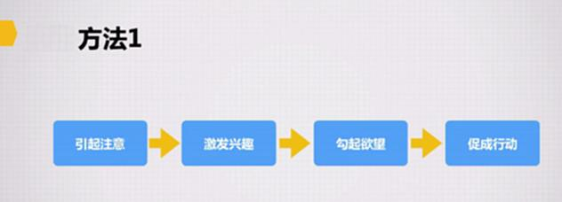

案例：

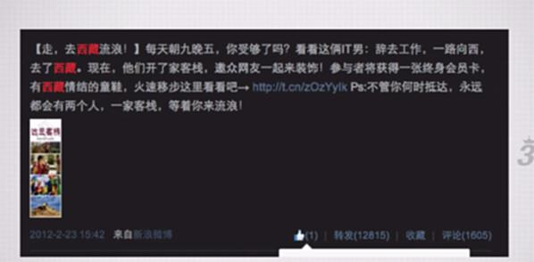

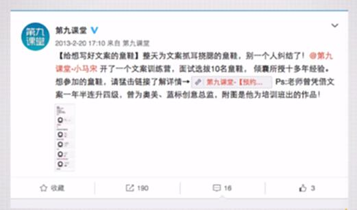

## 方法2：4步

代入情景-引起矛盾-提出问题-给出解决方案

案例：

代入情景

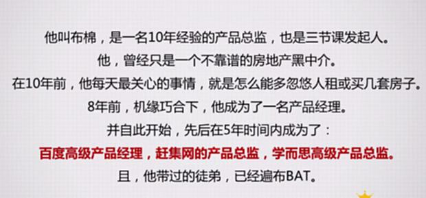

引出矛盾+提出问题+给出解决方案

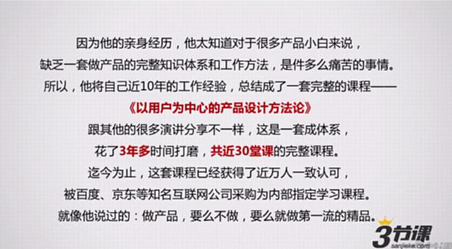

**降低用户进入门槛，让更多用户参与**

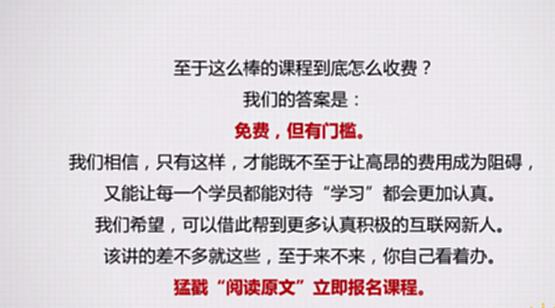

## 方法3：结构化，针对所有问题点依次进行详细解读

如——

对一堂课程而言，用户决定要不要报名参加，都会面临哪些潜在问题？

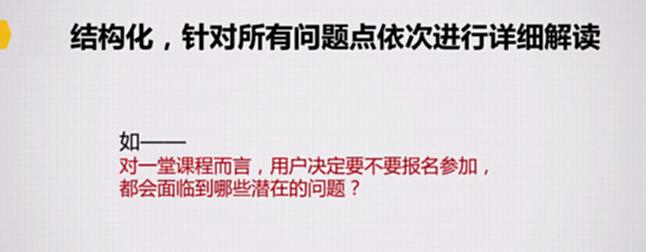

* 课程讲什么，能解决什么问题，不能解决什么问题？

* 跟其他同类课程比，课程有什么特色？

* 课程老师是谁？

* 课程适合什么样的人来听。不适合什么样的人来听？

* 课程的时长、时间、地址、费用？

* 如何报名？

* 其他人怎么评价这个课程？

* 其他

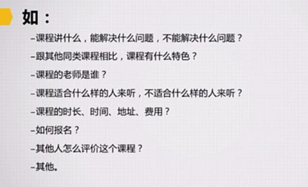

案例：

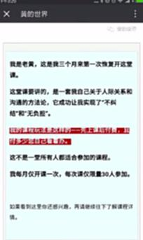

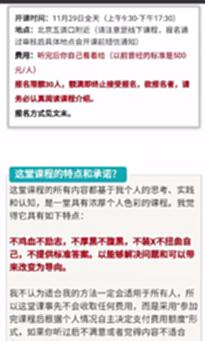

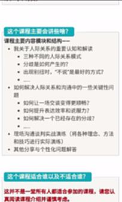

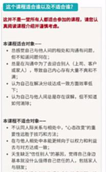

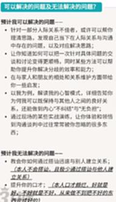

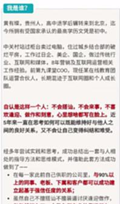

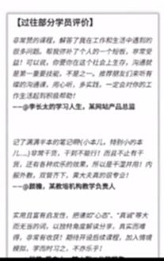

## 总结

### 文案的价值和写作原则

* 好的文案的两重价值：引发传播，制造转化

* 文案的写作原则：先建立认知，再激发兴趣，不要过分夸大价值。

### 高转化率短文案的写作要点

* 4个姿势：4W1H，颠覆认知or引发好奇，傍大款，人肉强力背书

* 2个关键要则：多用数字，多用识别度高的关键词

### 中长型转化文案的3种写作方法

* 引起注意-激发兴趣-勾起欲望-促成行动

* 代入情景-引起矛盾-提出问题-给出解决方案

* 针对所有潜在用户的疑问点依次进行解释

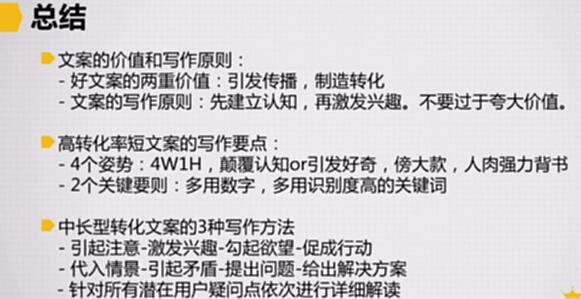

## 拓展阅读

点击以下链接获取相关文章：

[为什么80%的运营注定了只能打杂？](http://blog.sanjieke.cn/article/121432.html+%5Ch)
