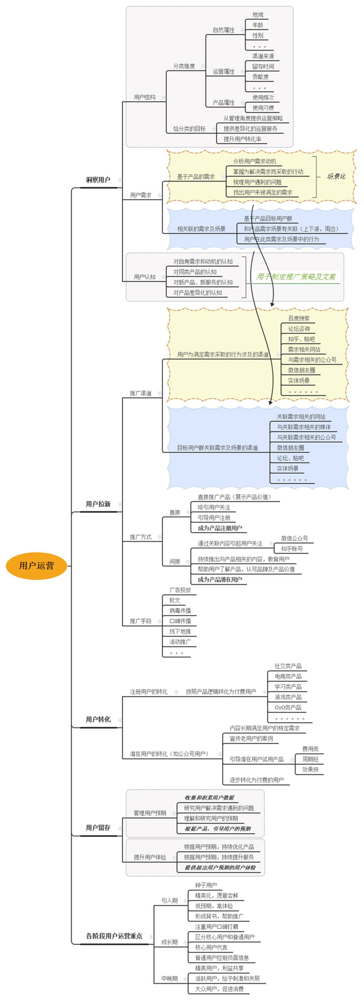
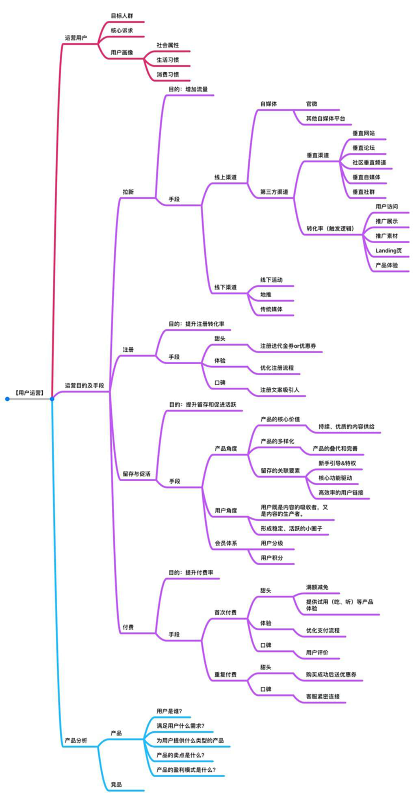
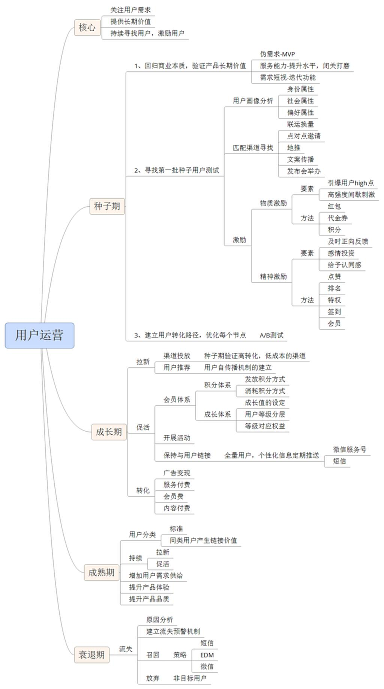
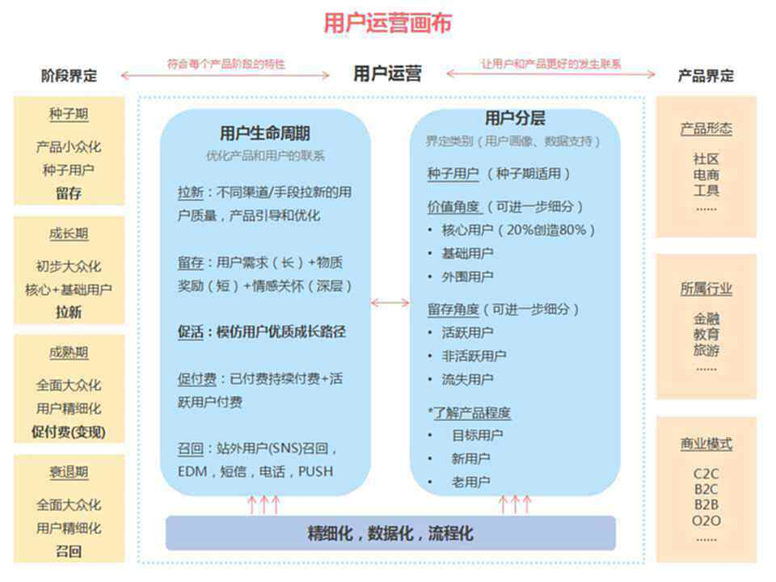
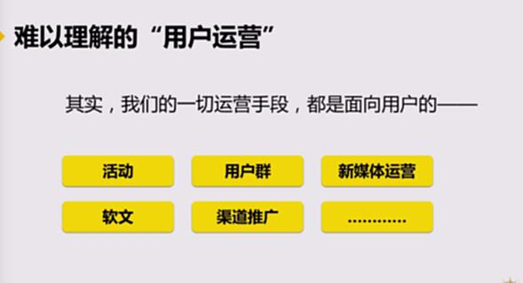
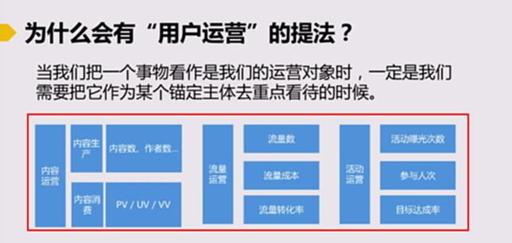
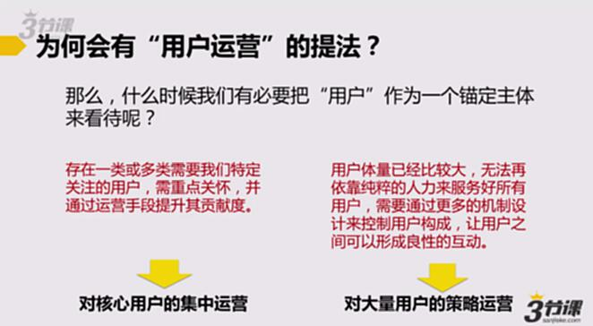
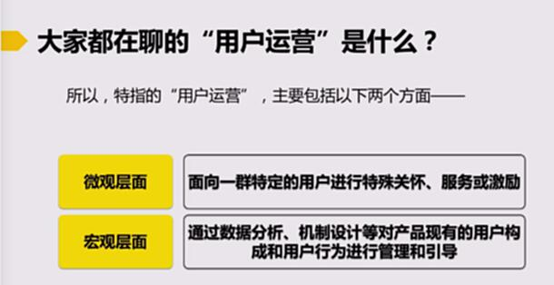

# S9.01：什么是用户运营？

##

## 课程导读

互联网行业中，大家一般会习惯将运营分为三大模块：内容运营、活动运营和用户运营。而其中相比较内容运营、活动运营而言，用户运营这个概念往往会比较难被大家理解。

接下来我我们一起学习一下：什么是用户运营。

## 难以理解的“用户运营”

**常见疑问：**

* 我在做渠道推广，算不算用户运营？

* 我经常做一些维护用户活跃度的活动，算不算用户运营？

* 我们这的QQ群都是我管，我是用户运营吗？

* ……

其实我们的一切运营手段都是面向用户的——

活动   用户群    新媒体运营

软文  渠道推广   ……

所以，到底什么是用户运营？

## 为什么会有“用户运营”的提法？

当我们把一个事物看作是我们的运营对象时，一定是我们需要把它作为某个锚定主体去重点看待的时候。

**锚定主体**：重点关注的部分，或者主要承压的部分。

以下的例子是以某一个特定锚定主体展开的运营：以内容为锚定主体、以流量为锚碇主体和以活动为锚定主体的运营内容展开：

## 为何会有“用户运营”的提法？

那么，什么时候我们有必要把“用户”作为一个锚定主体来看待呢？

### 第一种：对核心用户集中运营

存在一类或者多类需要我们特定关注的用户，需要重点关怀，并通过运营手段提升其贡献度。

### 第二种：对大量用户的策略运营

用户体量已经比较大，无法再依靠纯粹的人力来服务好所有用户，需要通过更多的机制设计来控制用户构成，让用户之间可以形成良性的互动。

## 大家都在聊的“用户运营”是什么？

所以，特指的“用户运营”，主要包括以下两个方面——

### 微观层面：

面向一群特定的用户进行特殊关怀、服务或激励

### 宏观层面：

通过数据分析、机制设计等对产品现有用户构成和用户行为进行管理和引导。

并非每一家公司都有必要设置一个叫做“用户运营”的岗位。

## 自我反思：不同用户，运营也不一样

也就是说不管从宏观和微观层面，都需要对用户进行细分，差别对待不同用户的运营方式。

微观层面：特定用户，也就是对企业价值贡献较大的用户，要采取什么样的运营

宏观层面：体量大的普通用户，通过数据来分析其行为，针对不同行为，设计不同运营方式？
