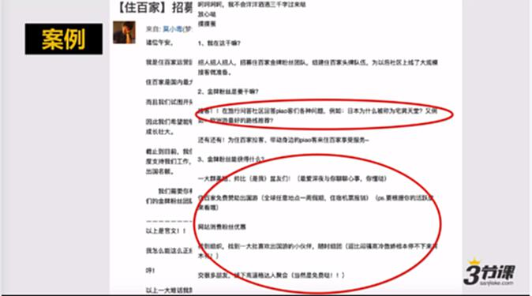
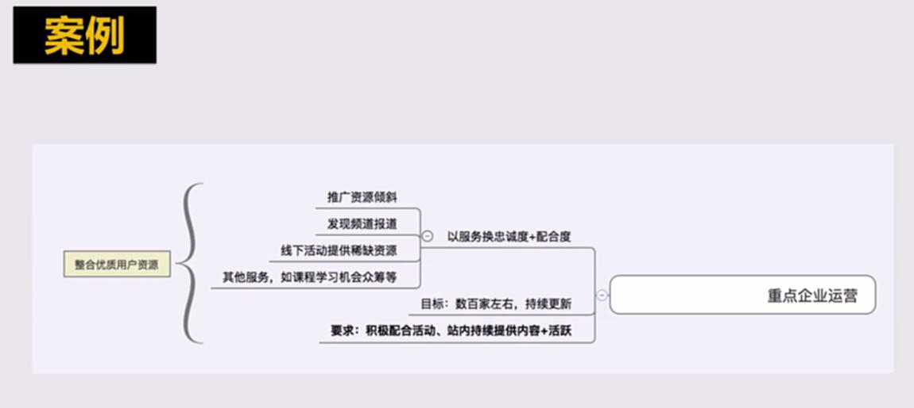
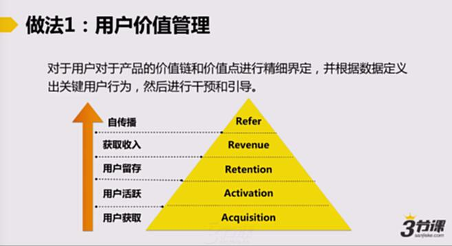
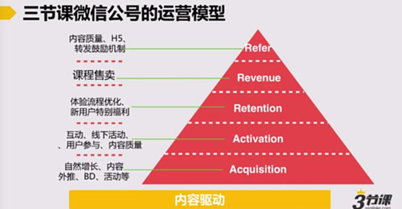
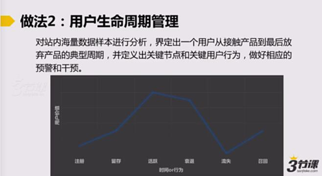
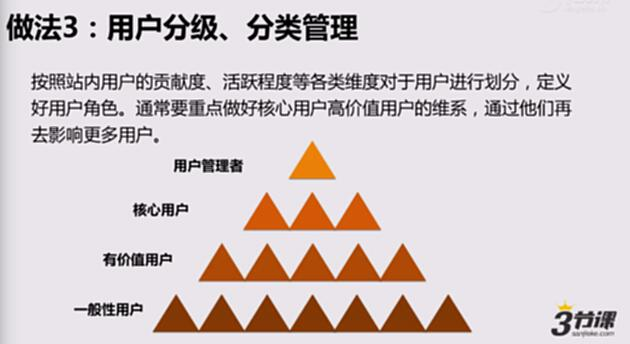
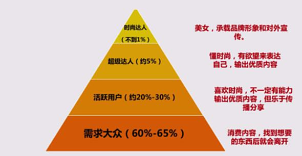
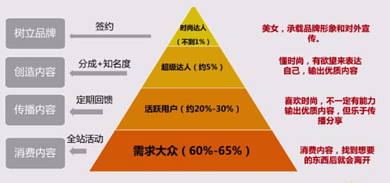
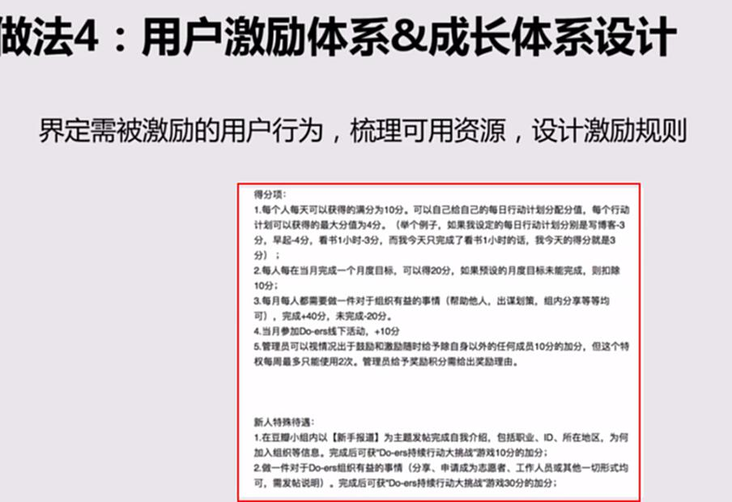
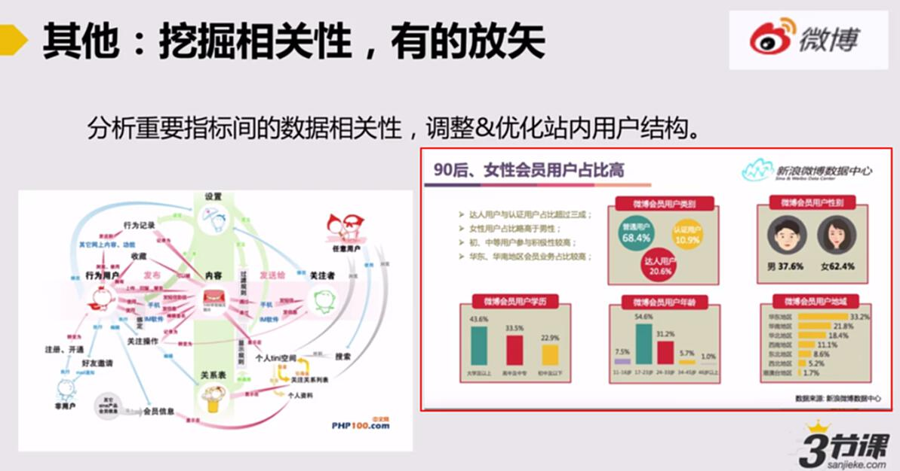

# S9.02：“用户运营”要怎么做？

## 对核心用户的“集中运营”

* 用户规模通常在几十人到几百人之间（备注：人再多一个人就Hold不住了，人太少意义又不大）；

* 以“个体”视角看待用户，用户互动频繁，用户与运营人员强情感关系，给予最大限度的重视和增强体验；包括：负面反馈一定要及时处理，有什么不好事情要及时应对。

* 往往有特定目标；

* 往往需要明确用户特权和义务；

## 案例：招募核心用户——用帖子方式

## 案例：周伯通重点企业用户运营

## 对大量用户的“策略运营”

* 用户规模可能从数千人到近百万人不等；

* 以“群体”视角看待用户，能明确定义群体特征，但用户对官方弱感知：有些像用户画像很像，什么年龄、喜欢去哪里等；

* 面对不同群体针对性设计运营策略&手段；

* 往往只有用户体量至少数十万以上的产品才需要做此考虑；

### 做法1：用户价值管理

对于用户对于产品的价值链和价值点进行精细界定（只注册的用户，有购买的用户等，要有不同的精细定位），并根据数据定义出关键用户行为，然后进行干预和引导

### AARRR模型：（重点）

**第一层：用户获取（Acquisition）**

**第二层：用户活跃（Actvation）**

**第三层：用户留存（Retention）**

**第四层：获取收入（Revenue）**

**第五层：自传播（Refer）**

### 案例：三节课微信公众号的运营模型

### 做法2：用户生命周期管理

对站内海量数据样本进行分析，界定出一个用户从接触产品到最后放弃产品的典型周期，并定义出关键节点和关键用户行为，做好相应的预警和干预。

**用户的关键行为**：注册、留存、活跃、衰退、流失、召回

### 做法3：用户分级、分类管理

按照站内用户的贡献度、活跃度等各类维度对于用户进行划分，定义好用户角色。通常要重点做好核心用户高价值用户的维系，通过他们再去影响更多用户。

### 用户金字塔模型（重点）

### 案例：美丽说，用户金字塔模型

### 具体运营手段

### 做法4：用户激励体系&成长体系设计

**界定需被激励的用户行为**，**梳理可用资源**，**设计激励规则**。

### 其他：挖掘相关性，有的放矢

分析重要指标间的数据相关性，调整&优化站内用户结构

### 案例：新浪微博：

