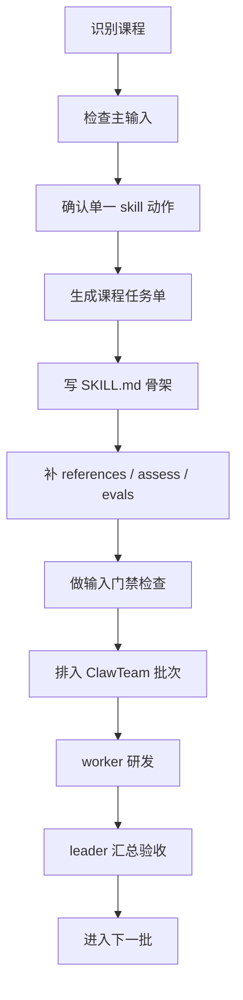

# 主流程

```mermaid
flowchart TD
    A[识别课程] --> B[检查主输入]
    B --> C[确认单一 skill 动作]
    C --> D[生成课程任务单]
    D --> E[写 SKILL.md 骨架]
    E --> F[补 references / assess / evals]
    F --> G[做输入门禁检查]
    G --> H[排入 ClawTeam 批次]
    H --> I[worker 研发]
    I --> J[leader 汇总验收]
    J --> K[进入下一批]
```

## 规则

- 先识别课程，再写 skill。
- 先确认主输入，再拆结构。
- 先做样板，再复制批量。
- 先验收当前批，再开下一批。
